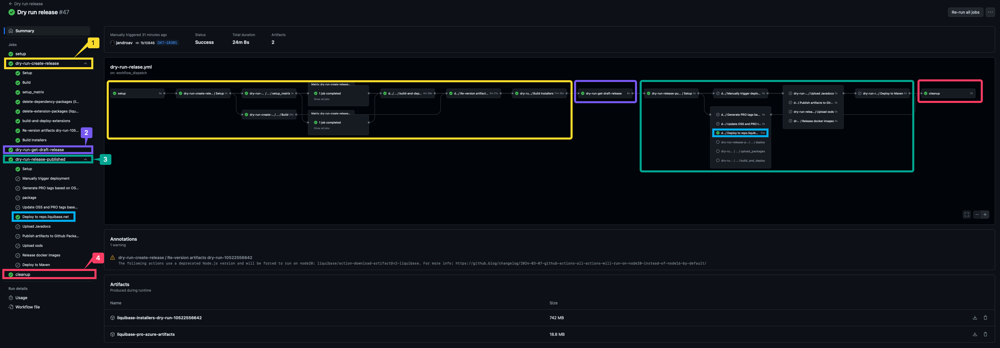
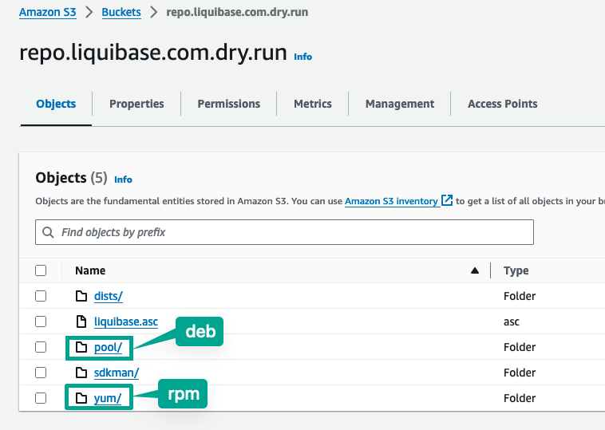
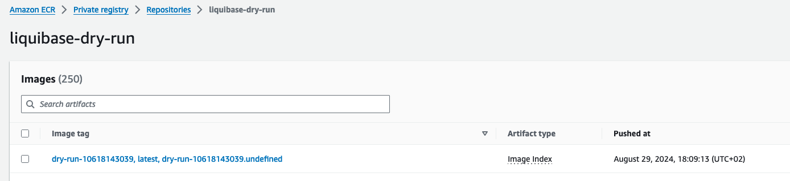

# :zap: Liquibase Release Workflows

## :arrows_clockwise: Liquibase Build Process Refactoring

https://datical.atlassian.net/wiki/spaces/DEV/pages/3371335681/Liquibase+Build+Process+Refactoring#New-Build.yml-%E2%86%92

## :fire: Liquibase DryRun Releases

The `dryRun` process simulates our current production Liquibase release workflow as closely as possible. It mimics all key release activities on a nightly basis, allowing us to anticipate and address any automation issues before the actual release.

## :star2: What a DryRun Release does?

The following actions are identical to those in a regular Liquibase release, with no modifications:

- Get latests liquibase artifacts from the `run-tests.yml` workflow
- Build included extensions in core (Commercial Bigquery)
- Build azure uber jars
- Re-version artifacts to `dry-run-GITHUB_RUN_ID` version. i.e `dry-run-10522556642`
- Build installers
- Attach artifacts (`zip` and `tar` files) to a dryRun draft release
- Upload `deb`, `rpm`, and `sdkman` to our test s3 repository: `s3://repo.liquibase.com.dry.run`
- Build `choco` package
- Build `ansible` package
- Executes the test for the `brew` PR creation
- Deploy artifacts to Maven, to our internal Maven repository: `https://repo.liquibase.net/repository/dry-run-sonatype-nexus-staging`
- Push `docker` images to our internal `ecr` repository: `812559712860.dkr.ecr.us-east-1.amazonaws.com/liquibase-dry-run`
- Delete the dryRun draft release. i.e `dry-run-10522556642`
- Delete the dryRun repository tag. i.e `vdry-run-10522556642`

## :warning: What a DryRun Release does not do?

- Generate PRO tags
- Generate install packages: `deb`, `rpm`, `brew` and the rest of them. (This will be covered in [DAT-18302](https://datical.atlassian.net/browse/DAT-18302))
- Upload `javadocs` and `xsds` to `S3`
- Deploy artifacts to `GPM`

## :wrench: How a DryRun Release works?

You can check the `dry-run-release.yml` workflow, which is essentially composed of calls to existing release workflows such as `create-release.yml` and `release-published.yml`. It sends them a new input, `dry_run: true`, to control which steps are executed for regular releases versus dry-run releases.

```yml
[...]

  dry-run-create-release:
    needs: [ setup ]
    uses: liquibase/liquibase/.github/workflows/create-release.yml@master
    with:
      version: "dry-run-${{ github.run_id }}"
      runId: ${{ needs.setup.outputs.dry_run_id }}
      standalone_zip: false
      dry_run: true
    secrets: inherit

[...]

  dry-run-release-published:
    needs: [ setup, dry-run-create-release, dry-run-get-draft-release ]
    uses: liquibase/liquibase/.github/workflows/release-published.yml@master
    with:
      tag: "vdry-run-${{ github.run_id }}"
      dry_run_release_id: ${{ needs.dry-run-get-draft-release.outputs.dry_run_release_id }}
      dry_run_zip_url: ${{ needs.dry-run-create-release.outputs.dry_run_zip_url }}
      dry_run_tar_gz_url: ${{ needs.dry-run-create-release.outputs.dry_run_tar_gz_url }}
      dry_run: true
    secrets: inherit

[...]
```

Here you can see all the stuff which is tested:

1. Create a draft release
2. Retrieve the draft release ID
3. Simulate a release publish event. In blue you can see the internal Maven deploy to `https://repo.liquibase.net/repository/dry-run-sonatype-nexus-staging` and other packages: `deb`, `rpm`, `sdkman`, `choco`, `brew`, `ansible`.
4. Clean up dryRun resources and send a **Slack** notification if the `dy-run` fails.



The process will conclude with the `dryRun` artifacts published in our Maven repository (`https://repo.liquibase.net/repository/dry-run-sonatype-nexus-staging`), `deb`, `rpm` and `sdkman` packages published in `s3://repo.liquibase.com.dry.run` and the `docker` image pushed to our internal `ecr` repo (`812559712860.dkr.ecr.us-east-1.amazonaws.com/liquibase-dry-run`):





