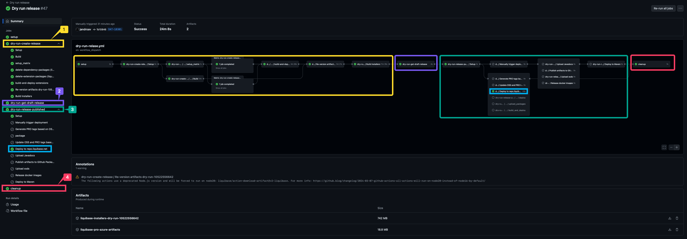
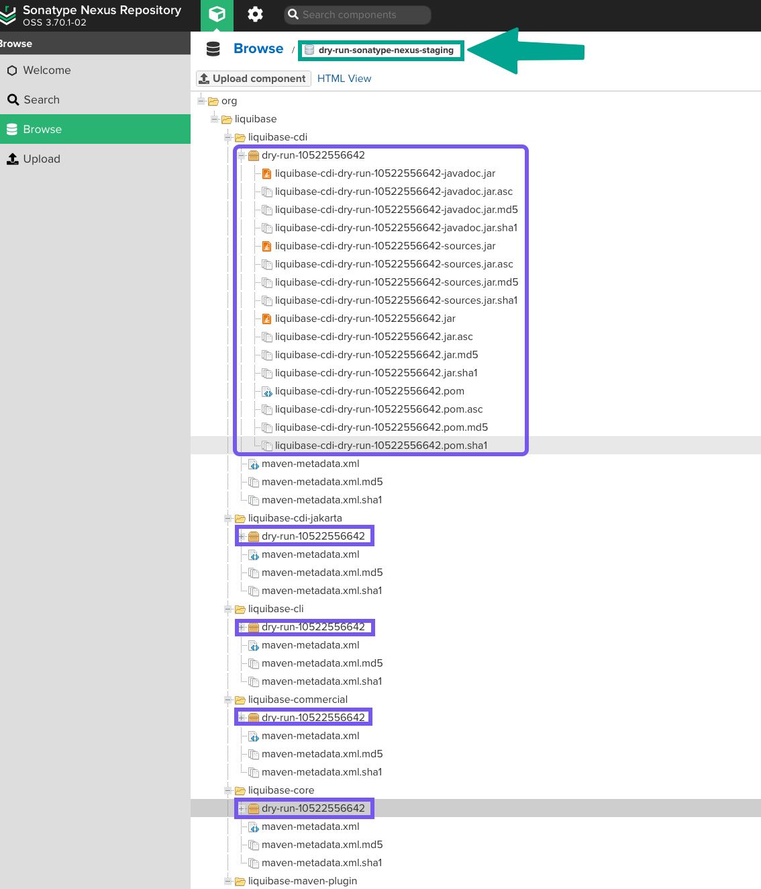
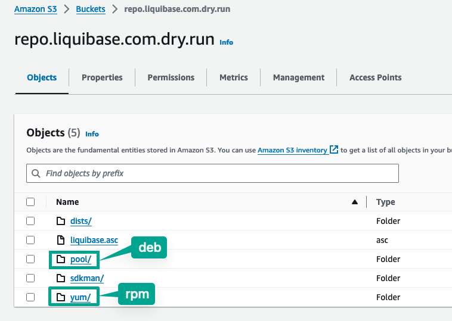
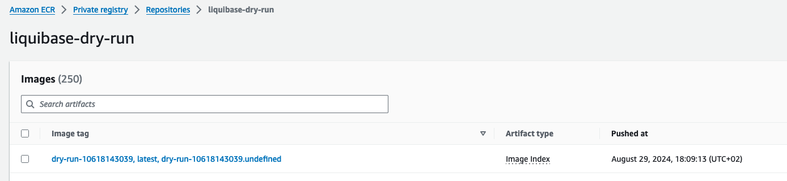

# :zap: Liquibase Workflows

## :shield: CI overview (TECHOPS-1100 remediation)

**Rule:** code from a pull request never runs with secrets.

`pull_request_target` is **not gone yet.** It is still live in `run-tests.yml` and
`run-test-harness.yml`, and all seven superseded workflows below are still `active` in the
Actions UI, so both pipelines run on every PR today. The rule above describes the new
workflows in this table; it becomes true of the repository at the TECHOPS-1222 cutover, when
those seven are disabled and their files deleted. [TECHOPS-1222]

| Workflow | Trigger | Secrets | Purpose |
|---|---|---|---|
| `pr.yml` | `pull_request` | none | Unit + integration matrix (via `ci-test.yml`) and a Docker smoke build. Same for fork, same-repo and Dependabot PRs. Required check: **PR Gate**. |
| `pr-labels.yml` | `pull_request` | none | Requires one release-notes label. Required check: **PR Labels**. |
| `ci-test.yml` | `workflow_call` | none | Shared test matrix used by `pr.yml` and `main.yml`. |
| `main.yml` | `push: main`, nightly cron, dispatch | vault (Sonar, FOSSA only) | Tests, Sonar, FOSSA, publishes `main-SNAPSHOT` and `<full-sha>-SNAPSHOT` to GitHub Packages, uploads `liquibase-artifacts`, recreates the `nightly` pre-release. |
| `snapshot-branch.yml` | dispatch (maintainers) | none | Publishes `<full-sha>-SNAPSHOT` for any ref so QA can target an unreleased branch from liquibase-test-harness / liquibase-pro-tests. |
| `docker.yml` | `push: main` (docker/**), cron, dispatch | vault | Full Docker test + vulnerability scan via build-logic reusables; persists main scan to `scan-results`. |
| `cleanup-packages.yml` | weekly cron, dispatch | none | Deletes orphaned `<sha>-SNAPSHOT` package versions. |

**Superseded (to be disabled at cutover, files kept for history):** `run-tests.yml`, `test-pr.yml`, `build.yml`, `build-branch.yml`, `build-main.yml`, `nightly-release.yml`, `run-test-harness.yml`, `label-pr.yml`, `docker-test.yml`, `docker-scan.yml`, `cleanup-branch-builds.yml`, `installer-build-check.yml`, `owasp-scanner.yml`, `weekly-integration-tests.yml`, `fossa.yml`, `dry-run-release.yml`, `claude-code-review.yml`.

**Consumers of `main.yml` outputs**

- `main-SNAPSHOT` / `<full-sha>-SNAPSHOT` on GitHub Packages: liquibase-test-harness, liquibase-pro nightly wrappers, build-logic `os-extension-test`.
- `liquibase-artifacts` run artifact: `create-release.yml` (`runId` input) until the release pipeline builds from tag.

**Not on PRs anymore:** SNAPSHOT publishing, Sonar, FOSSA, test-harness dispatch. Run them from `main.yml`, `snapshot-branch.yml`, or the harness repo directly.

**Required checks**

`PR Gate` and `PR Labels` are enforced by the `strict_status_checks` ruleset, not by
`strict_branch_protection`. Status checks live in their own ruleset because a ruleset bypass is
all-or-nothing: keeping them separate is what lets devops break the glass on a stuck check while
review stays enforced. The same mechanism means the gate binds everyone **except** the
`liquibase-devops` team and the two integration apps, which hold an always-bypass on that
ruleset. [TECHOPS-1155]

Two heads-ups for contributors:

- A pull request opened before this CI existed has never run `PR Gate`, and a required check
  that has never reported blocks the merge. It shows as "Expected - Waiting for status to be
  reported" with nothing to click. Push a commit (an empty one is enough) and it clears.
- Branch SNAPSHOTs are no longer published per PR. Dispatch `snapshot-branch.yml` on the branch
  first: `gh workflow run snapshot-branch.yml --repo liquibase/liquibase --ref <branch> -f ref=<branch>`

**Why build-logic reusables are referenced as `@main`, not SHA-pinned**

Every `uses: liquibase/build-logic/.github/workflows/*.yml@main` here is deliberate. Pinning
per consumer repo was considered and rejected on 2026-08-25: it creates 20+ bump sites in each
of ~30 repos, and in practice those pins go stale, which is worse than the moving reference.

What compensates for the moving reference is that `main` in build-logic is not writable without
review: its `reviewed_branch_protection` ruleset requires an approval and a code-owner review
with no admin bypass, and its `.github/CODEOWNERS` gives `liquibase-devops` ownership of every
path. A malicious change to a reusable workflow therefore needs a devops approval, the same bar
as a change to this repo. Revisit the trade-off only if that ruleset or CODEOWNERS changes.
[TECHOPS-1109]

# :package: Release workflows

## :arrows_clockwise: Liquibase Build Process Refactoring

https://datical.atlassian.net/wiki/spaces/DEV/pages/3371335681/Liquibase+Build+Process+Refactoring#New-Build.yml-%E2%86%92

## :fire: Liquibase DryRun Releases

The `dryRun` process simulates our current production Liquibase release workflow as closely as possible. It mimics all key release activities on a nightly basis, allowing us to anticipate and address any automation issues before the actual release.

## :star2: What a DryRun Release does?

The following actions are identical to those in a regular Liquibase release, with no modifications:

- Get latests liquibase artifacts from the `main.yml` workflow
- Re-version artifacts to `dry-run-GITHUB_RUN_ID` version. i.e `dry-run-10522556642`
- Build installers
- Attach artifacts (`zip` and `tar` files) to a dryRun draft release
- Upload `deb`, `rpm`, and `sdkman` to our test s3 repository: `s3://repo.liquibase.com.dry.run`
- Build `choco` package
- Build `ansible` package
- Executes the test for the `brew` PR creation
- Deploy artifacts to Maven, to our internal Maven repository: `https://repo.liquibase.net/repository/dry-run-sonatype-nexus-staging`
- Delete the dryRun draft release. i.e `dry-run-10522556642`
- Delete the dryRun repository tag. i.e `vdry-run-10522556642`

## :warning: What a DryRun Release does not do?

- Generate PRO tags
- Generate install packages: `deb`, `rpm`, `brew` and the rest of them.
- Upload `javadocs` and `xsds` to `S3`
- Deploy artifacts to `GPM`

## :wrench: How a DryRun Release works?

You can check the `dry-run-release.yml` workflow, which is essentially composed of calls to existing release workflows such as `create-release.yml` and `release-published-orchestrator.yml`. It sends them a new input, `dry_run: true`, to control which steps are executed for regular releases versus dry-run releases.

```yml
[...]

  dry-run-create-release:
    needs: [ setup ]
    uses: liquibase/liquibase/.github/workflows/create-release.yml@main
    with:
      version: "dry-run-${{ github.run_id }}"
      runId: ${{ needs.setup.outputs.dry_run_id }}
      standalone_zip: false
      dry_run: true
    secrets: inherit

[...]

  dry-run-release-published:
    needs: [ setup, dry-run-create-release, dry-run-get-draft-release ]
    uses: liquibase/liquibase/.github/workflows/release-published-orchestrator.yml@main
    with:
      tag: "vdry-run-${{ github.run_id }}"
      dry_run_release_id: ${{ needs.dry-run-get-draft-release.outputs.dry_run_release_id }}
      dry_run_zip_url: ${{ needs.dry-run-create-release.outputs.dry_run_zip_url }}
      dry_run_tar_gz_url: ${{ needs.dry-run-create-release.outputs.dry_run_tar_gz_url }}
      dry_run: true
    secrets: inherit

[...]
```

Here you can see all the stuff which is tested:

1. Create a draft release
2. Retrieve the draft release ID
3. Simulate a release publish event. In blue you can see the internal Maven deploy to `https://repo.liquibase.net/repository/dry-run-sonatype-nexus-staging` and other packages: `deb`, `rpm`, `sdkman`, `choco`, `brew`, `ansible`.
4. Clean up dryRun resources and send a **Slack** notification if the `dy-run` fails.



The process will conclude with the `dryRun` artifacts published in our Maven repository (`https://repo.liquibase.net/repository/dry-run-sonatype-nexus-staging`), `deb`, `rpm` and `sdkman` packages published in `s3://repo.liquibase.com.dry.run` and the `docker` image pushed to our internal `ecr` repo (`812559712860.dkr.ecr.us-east-1.amazonaws.com/liquibase-dry-run`):







---

# :rocket: Release Published Orchestrator - Implementation Guide

## Overview

This document describes the orchestrator pattern implementation for the Liquibase release process. The refactored release workflows follow the pattern established in `liquibase-pro`, providing better modularity, maintainability, and error recovery.

## Architecture

### Orchestrator Workflow
**File:** `release-published-orchestrator.yml`

The main coordinator that triggers all release steps in the proper sequence. Supports the same events as the original workflow:
- `release.published` - Automatic trigger when a GitHub release is published
- `workflow_dispatch` - Manual trigger with custom inputs
- `workflow_call` - Can be called by other workflows

### Extracted Reusable Workflows

| Workflow | Purpose | Can Run Independently |
|----------|---------|----------------------|
| `release-setup.yml` | Extract release metadata (version, tag, branch) | ✅ Yes |
| `release-manual-approval.yml` | Hold the release for approval on the `release` environment | ✅ Yes |
| `release-deploy-maven.yml` | Deploy artifacts to Maven Central | ✅ Yes |
| `release-deploy-javadocs.yml` | Upload javadocs to S3 | ✅ Yes |
| `release-publish-github-packages.yml` | Publish to GitHub Packages | ✅ Yes |
| `release-deploy-xsd.yml` | Deploy XSD files to S3 and SFTP | ✅ Yes |
| `release-docker.yml` | Trigger Docker image builds | ✅ Yes |
| `release-publish-assets-s3.yml` | Publish release assets to S3 | ✅ Yes |

## Key Benefits

### 1. **Individual Workflow Execution**
Each workflow can be triggered manually via `workflow_dispatch` if it fails during the orchestrated release. This eliminates the need to re-run the entire release process.

**Example:** If Maven deployment fails, you can:
1. Fix the issue
2. Go to Actions → `Release Deploy Maven` → Run workflow
3. Provide the version and other required inputs
4. Execute just that step

### 2. **Better Visibility**
Each workflow appears as a separate run in the Actions tab, making it easier to:
- Identify which specific step failed
- View detailed logs for each component
- Track execution time per stage
- Monitor parallel execution

### 3. **Improved Maintainability**
- Smaller, focused workflow files (~50-150 lines each)
- Clear single responsibility per workflow
- Easier to update individual components
- Reduced risk of introducing bugs when making changes

### 4. **Consistent with liquibase-pro**
The pattern matches the orchestrator approach used in `liquibase-pro`:
- Similar job structure and naming
- Comparable error handling
- Consistent summary generation
- Same dry-run support

## Usage

### Normal Release (Production)

When a GitHub release is published, the orchestrator automatically:
1. Extracts release metadata
2. Waits for approval on the `release` environment (one reviewer, and not the person who started the run)
3. Deploys to all targets in parallel where possible
4. Generates a comprehensive summary

### Dry Run Release

For testing the release process without actually deploying:

```bash
# Via GitHub UI: Actions → Release Published Orchestrator → Run workflow
# Set inputs:
#   tag: v4.28.0
#   dry_run: true
#   dry_run_branch_name: release/4.28.0
```

Dry run mode:
- Skips manual approval
- Skips actual deployments to production
- Uses USER_MANAGED publishing for Maven (requires manual confirmation)
- Logs what would be done without executing

### Manual Trigger (Re-run Failed Steps)

If a specific step fails, you can re-run just that workflow:

1. Navigate to **Actions** tab
2. Find the failed workflow (e.g., "Release Deploy Maven")
3. Click **Run workflow**
4. Fill in required inputs:
   - `version`: 4.28.0
   - `tag`: v4.28.0
   - `dry_run`: false (for production)
5. Click **Run workflow**

## Deployment Pipeline

```
┌─────────────────────────────────────────────────────────────────┐
│                  Release Published Event                         │
│              (or workflow_dispatch trigger)                      │
└──────────────────────┬──────────────────────────────────────────┘
                       │
                       ▼
              ┌────────────────┐
              │     Setup      │  Extract version, branch, SHA, timestamp
              └────────┬───────┘
                       │
                       ▼
              ┌────────────────┐
              │Manual Approval │  `release` environment gate (skipped if dry_run)
              └────────┬───────┘
                       │
        ┌──────────────┴──────────────┐
        │                             │
        ▼                             ▼
┌───────────────┐            ┌────────────────┐
│ Deploy        │            │ Publish to     │
│ Javadocs      │            │ GitHub Packages│
└───────┬───────┘            └───────┬────────┘
        │                            │
        │    ┌───────────────────────┤
        │    │                       │
        ▼    ▼                       ▼
  ┌──────────────┐          ┌────────────┐
  │ Deploy XSD   │          │  Docker    │
  └──────┬───────┘          └──────┬─────┘
         │                         │
         └─────────────────────────┘
                                   │
                                   ▼
                        ┌──────────────────┐
                        │  Deploy to Maven │
                        │     Central      │
                        └──────────────────┘
                                   
         Parallel Execution:
         ┌─────────────┐        ┌──────────────────┐
         │   Package   │        │Publish Assets S3 │
         └─────────────┘        └──────────────────┘
                                   
                                   │
                                   ▼
                        ┌──────────────────┐
                        │Generate Summary  │
                        └──────────────────┘
```

## Testing Strategy

### Before Production Use

1. **Test Dry Run Mode**
   ```bash
   # Create a test branch
   git checkout -b test/orchestrator-v4.28.0-test
   
   # Trigger dry run
   # Actions → Release Published Orchestrator → Run workflow
   #   tag: v4.28.0-test
   #   dry_run: true
   ```

2. **Verify Individual Workflows**
   - Test each workflow can be triggered independently
   - Confirm outputs are correctly passed between workflows
   - Verify secrets inheritance works

3. **Test Manual Approval Logic**
   - Confirm approval is skipped in dry_run mode
   - Verify 2 approvers are required in production mode

4. **Validate Summary Generation**
   - Check that all job statuses appear correctly
   - Verify success/failure icons display properly
   - Confirm links in summary are correct

### Failure Scenario Testing

Test the orchestrator's ability to handle failures:

1. **Partial Failure**: Kill one workflow mid-execution
   - Verify other workflows continue
   - Confirm failed workflow can be re-run individually

2. **Dependency Failure**: Simulate a failure in `deploy-javadocs`
   - Verify `deploy-maven` (which depends on it) doesn't run
   - Confirm manual re-run is possible

3. **Complete Failure**: Simulate failure in `setup`
   - Verify downstream workflows are skipped
   - Confirm summary shows failure status

## Maintenance

### Adding New Release Steps

To add a new step to the release process:

1. **Create** new reusable workflow file:
   ```yaml
   name: Release Deploy NewService
   on:
     workflow_call:
       inputs:
         version:
           required: true
           type: string
   ```

2. **Add** to orchestrator:
   ```yaml
   deploy-new-service:
     needs: [setup, manual-approval]
     uses: ./.github/workflows/release-deploy-new-service.yml
     with:
       version: ${{ needs.setup.outputs.version }}
     secrets: inherit
   ```

3. **Update** summary generation to include new step

### Modifying Existing Steps

1. Edit the specific workflow file
2. Test via `workflow_dispatch`
3. No changes needed to orchestrator unless inputs/outputs change

## Troubleshooting

### Common Issues

**Issue**: Workflow doesn't trigger on release published
- **Solution**: Check permissions in orchestrator file
- **Solution**: Verify GitHub App has correct permissions

**Issue**: Manual approval never arrives or is rejected
- **Solution**: Check the run's deployment gate, not the issues list: approval happens on the run page under Review deployments
- **Solution**: Check the reviewer list on the `release` environment. It is managed in [liquibase-release-environment.tf](https://github.com/liquibase/liquibase-infrastructure/blob/main/github/liquibase/repos/public/liquibase-release-environment.tf), so changing it takes a PR in liquibase-infrastructure
- **Solution**: A reviewer cannot approve a run they started themselves. Someone else on the list has to

**Issue**: Secrets not available in called workflows
- **Solution**: Ensure `secrets: inherit` is present
- **Solution**: Verify secrets exist at repository level

**Issue**: Output not passed between workflows
- **Solution**: Check outputs are defined in called workflow
- **Solution**: Verify correct reference in orchestrator

## Support

For questions or issues:
1. Check this documentation
2. Review workflow run logs in Actions tab
3. Consult the liquibase-pro orchestrator implementations as reference
4. Contact the build/release team

---

**Note:** This orchestrator pattern is consistent with modern CI/CD best practices and the approach used in `liquibase-pro`. It provides better maintainability and reliability for the Liquibase release process.

---

# :repeat: Manual Workflow Retry Guide

This guide shows how to manually trigger each workflow if it fails during an orchestrated release.

## Quick Reference

All workflows can be triggered manually via the GitHub Actions UI:
1. Go to **Actions** tab
2. Select the workflow from the left sidebar
3. Click **Run workflow** button
4. Fill in the required inputs
5. Click **Run workflow**

## Workflow-by-Workflow Instructions

### 1. Release Setup (`release-setup.yml`)

**When to use:** If the initial setup fails or you need to regenerate release metadata.

**Required inputs:**
- `tag`: Release tag (e.g., `v4.28.0`)

**Optional inputs:**
- `dry_run`: false (default) or true for dry-run mode
- `dry_run_branch_name`: Branch name for dry-run (e.g., `release/4.28.0`)

**Example:**
```
tag: v4.28.0
dry_run: false
dry_run_branch_name: (leave empty for production)
```

### 2. Release Manual Approval (`release-manual-approval.yml`)

**When to use:** Normally never on its own. Approval is per-run: a paused orchestrator run is
approved from **Review deployments** on that run's page, and dispatching this workflow standalone
only gates its own, empty run. It exists as the reusable gate job the orchestrator calls.

**How approval works:** The job carries `environment: release`, so GitHub pauses it and shows
**Review deployments** on the run page. Any reviewer on that environment can approve or reject,
except the person who started the run. There is no tracking issue and no keyword replies. The
reviewer list is Terraform-managed in [liquibase-release-environment.tf](https://github.com/liquibase/liquibase-infrastructure/blob/main/github/liquibase/repos/public/liquibase-release-environment.tf).

**Required inputs:**
- `version`: Version to approve (e.g., `4.28.0`)

**Optional inputs:**
- `dry_run`: false (default) - if true, workflow will be skipped

**Example:**
```
version: 4.28.0
dry_run: false
```

**Note:** One approval from the environment's reviewer list releases the gate, and the approver
cannot be the person who started the run (`prevent_self_review`).

### 3. Deploy to Maven Central (`release-deploy-maven.yml`)

**When to use:** If Maven deployment fails or times out.

**Required inputs:**
- `version`: Version to deploy (e.g., `4.28.0`)
- `tag`: Release tag (e.g., `v4.28.0`)

**Optional inputs:**
- `dry_run`: false (default) or true for USER_MANAGED publishing
- `dry_run_release_id`: Release ID for dry-run (only if dry_run=true)

**Example (Production):**
```
version: 4.28.0
tag: v4.28.0
dry_run: false
dry_run_release_id: (leave empty)
```

### 4. Deploy Javadocs (`release-deploy-javadocs.yml`)

**When to use:** If javadoc upload to S3 fails.

**Required inputs:**
- `version`: Version to deploy (e.g., `4.28.0`)
- `tag`: Release tag (e.g., `v4.28.0`)

**Optional inputs:**
- `dry_run`: false (default) - if true, workflow will be skipped

**Example:**
```
version: 4.28.0
tag: v4.28.0
dry_run: false
```

### 5. Publish to GitHub Packages (`release-publish-github-packages.yml`)

**When to use:** If GitHub Packages publishing fails.

**Required inputs:**
- `version`: Version to publish (e.g., `4.28.0`)
- `latestMergeSha`: Git commit SHA (e.g., `abc1234`)
- `timeStamp`: Build timestamp (e.g., `2024-01-15 14:30:00 UTC`)

**Optional inputs:**
- `dry_run`: false (default) - if true, workflow will be skipped

**Example:**
```
version: 4.28.0
latestMergeSha: abc1234
timeStamp: 2024-01-15 14:30:00 UTC
dry_run: false
```

**Note:** To get `latestMergeSha` and `timeStamp`, check the setup workflow outputs.

### 6. Deploy XSD Files (`release-deploy-xsd.yml`)

**When to use:** If XSD file deployment to S3 or SFTP fails.

**Required inputs:**
- `version`: Version to deploy (e.g., `4.28.0`)

**Optional inputs:**
- `dry_run`: false (default) - if true, workflow will be skipped

**Example:**
```
version: 4.28.0
dry_run: false
```

### 7. Release Docker Images (`release-docker.yml`)

**When to use:** If Docker image build fails.

**Required inputs:**
- `version`: Version to release (e.g., `4.28.0`)

**Optional inputs:**
- `dry_run`: false (default) or true to skip actual build

**Example:**
```
version: 4.28.0
dry_run: false
```

**Note:** This triggers a workflow in the `liquibase/docker` repository.

### 8. Publish Assets to S3 (`release-publish-assets-s3.yml`)

**When to use:** If S3 asset upload fails.

**Required inputs:**
- `version`: Version to publish (e.g., `4.28.0`)

**Optional inputs:**
- `dry_run`: false (default) - if true, workflow will be skipped

**Example:**
```
version: 4.28.0
dry_run: false
```

## Common Scenarios

### Scenario 1: Maven Deployment Failed

1. Fix the issue (e.g., Maven Central credentials, network issue)
2. Go to Actions → "Release Deploy Maven" → Run workflow
3. Fill in:
   ```
   version: 4.28.0
   tag: v4.28.0
   dry_run: false
   ```
4. Click "Run workflow"

### Scenario 2: Docker Build Timed Out

1. Go to Actions → "Release Docker" → Run workflow
2. Fill in:
   ```
   version: 4.28.0
   dry_run: false
   ```
3. Click "Run workflow"

### Scenario 3: Multiple Workflows Failed

If multiple workflows failed, you may want to:
1. Check if there's a common cause (e.g., network, credentials)
2. Re-run the orchestrator from the failed step onwards, OR
3. Manually trigger each failed workflow individually in the correct order

### Scenario 4: Need to Get Setup Outputs

If you need values like `latestMergeSha` or `timeStamp`:
1. Go to the original orchestrator run
2. Click on "setup" job
3. Expand "Setup Release Metadata" step
4. Look for the output values at the end of the logs

## Dependency Order

If manually running multiple workflows, follow this order:

```
1. release-setup (must run first)
   ↓
2. release-manual-approval (if needed)
   ↓
3. Parallel (can run these together):
   - release-deploy-javadocs
   - release-publish-github-packages
   - release-deploy-xsd
   - release-docker
   ↓
4. release-deploy-maven (waits for step 3)
   ↓
5. release-publish-assets-s3 (final step)
```

## Tips

- **Always check the logs** of the failed workflow to understand what went wrong
- **Don't re-run workflows that succeeded** - focus only on the failures
- **For dry-run testing**, set `dry_run: true` to test without actually deploying
- **Keep the version consistent** - use the same version across all manual retries
- **Check orchestrator outputs** - the setup job outputs (SHA, timestamp) may be needed for some workflows

## Getting Help

If a workflow continues to fail:
1. Check the workflow logs for detailed error messages
2. Verify all secrets and credentials are correctly configured
3. Check AWS/Maven/Docker service status
4. Consult the team or escalate to DevOps

## :wastebasket: Removed workflows

Deleted 2026-08-27 (TECHOPS-1188). All seven were already `disabled_manually` in the
Actions API and none of them declares an `on: workflow_call` trigger, so no active
workflow could reach them: deleting the files removes the ability for anyone to
re-enable them from the Actions UI.

| Workflow | Own runs (all time) | Last run | Why it was removed |
|---|---|---|---|
| `build-branch.yml` | 3239 | 2026-08-25 | Per-PR SNAPSHOT publisher. `pull_request_target` + `packages: write` + `secrets: inherit`; branch snapshots are no longer published per PR. |
| `claude-code-review.yml` | 1109 | 2026-08-25 | Last 15 runs were all `startup_failure`. Replaced by `@claude review` on the gated `claude.yml` (active, 3675 runs). |
| `cleanup-branch-builds.yml` | 613 | 2026-08-25 | 29 of its last 30 runs failed, so it deleted nothing. |
| `fossa.yml` | 0 | never | Never executed once since creation. FOSSA runs today as the `fossa / fossa-scan` job of `run-tests.yml` via `build-logic/fossa_ai.yml`. |
| `installer-build-check.yml` | 2 | 2026-04-13 | Both runs failed. Installers are built by the release pipeline and rehearsed weekly by `dry-run-release.yml`. |
| `owasp-scanner.yml` | 1 | 2025-10-02 | One run ever. Dependency CVEs are covered by `codeql.yml`, `trivy-scan-published-images.yml` and Dependabot. |
| `weekly-integration-tests.yml` | 19 | 2025-11-16 | Scheduled run dead since 2025-11 and its Slack alert could never fire: it dispatched cross-repo to `build-logic` with `secrets.GITHUB_TOKEN`, which is scoped to this repo only. |

Not removed, and why: `build.yml` and `run-test-harness.yml` are marked
`disabled_manually` but still execute on every internal PR and every push to `main`.
`run-tests.yml` (active) calls `./.github/workflows/build.yml`, which calls
`liquibase/liquibase/.github/workflows/run-test-harness.yml@main`. Disabling a
workflow blocks its event triggers, never `workflow_call`. Both files can only be
deleted after `run-tests.yml` is retired at the PR #7944 cutover.
