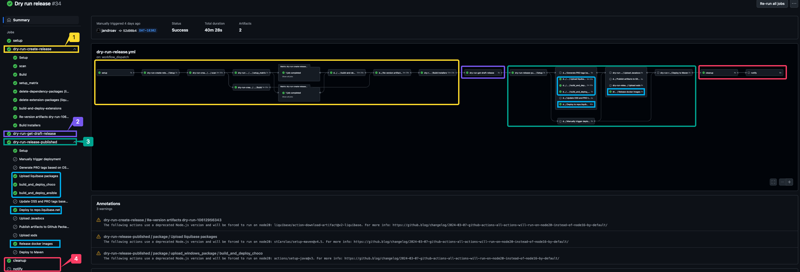
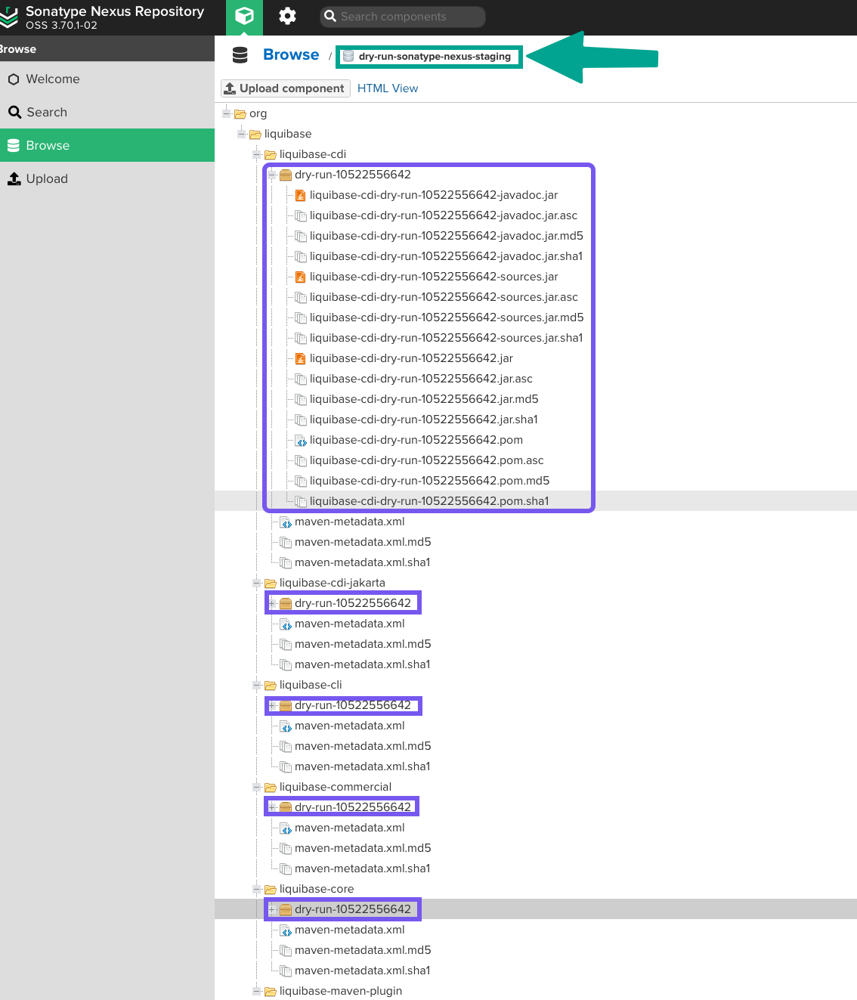

# :zap: Liquibase Release Workflows

## :arrows_clockwise: Liquibase Build Process Refactoring

https://datical.atlassian.net/wiki/spaces/DEV/pages/3371335681/Liquibase+Build+Process+Refactoring#New-Build.yml-%E2%86%92

## :fire: Liquibase DryRun Releases

The `dryRun` process simulates our current production Liquibase release workflow as closely as possible. It mimics all key release activities on a nightly basis, allowing us to anticipate and address any automation issues before the actual release.

## :star2: What a DryRun Release does?

The following actions are identical to those in a regular Liquibase release, with no modifications:

- Get latests liquibase artifacts from the `run-tests.yml` workflow
- Re-version artifacts to `dry-run-GITHUB_RUN_ID` version. i.e `dry-run-10522556642`
- Build installers
- Attach artifacts (`zip` and `tar` files) to a dryRun draft release
- Upload `deb`, `rpm`, and `sdkman` to our test s3 repository: `s3://repo.liquibase.com.dry.run`
- Build `choco` package
- Build `ansible` package
- Executes the test for the `brew` PR creation
- Deploy artifacts to Maven, to our internal Maven repository: `https://repo.liquibase.net/repository/dry-run-sonatype-nexus-staging`
- Push `docker` images to our internal `ecr` repository: `812559712860.dkr.ecr.us-east-1.amazonaws.com/liquibase-dry-run`
- Delete the dryRun draft release. i.e `dry-run-10522556642`
- Delete the dryRun repository tag. i.e `vdry-run-10522556642`

## :warning: What a DryRun Release does not do?

- Generate PRO tags
- Generate install packages: `deb`, `rpm`, `brew` and the rest of them.
- Upload `javadocs` and `xsds` to `S3`
- Deploy artifacts to `GPM`

## :wrench: How a DryRun Release works?

You can check the `dry-run-release.yml` workflow, which is essentially composed of calls to existing release workflows such as `create-release.yml` and `release-published.yml`. It sends them a new input, `dry_run: true`, to control which steps are executed for regular releases versus dry-run releases.

```yml
[...]

  dry-run-create-release:
    needs: [ setup ]
    uses: liquibase/liquibase/.github/workflows/create-release.yml@master
    with:
      version: "dry-run-${{ github.run_id }}"
      runId: ${{ needs.setup.outputs.dry_run_id }}
      standalone_zip: false
      dry_run: true
    secrets: inherit

[...]

  dry-run-release-published:
    needs: [ setup, dry-run-create-release, dry-run-get-draft-release ]
    uses: liquibase/liquibase/.github/workflows/release-published.yml@master
    with:
      tag: "vdry-run-${{ github.run_id }}"
      dry_run_release_id: ${{ needs.dry-run-get-draft-release.outputs.dry_run_release_id }}
      dry_run_zip_url: ${{ needs.dry-run-create-release.outputs.dry_run_zip_url }}
      dry_run_tar_gz_url: ${{ needs.dry-run-create-release.outputs.dry_run_tar_gz_url }}
      dry_run: true
    secrets: inherit

[...]
```

Here you can see all the stuff which is tested:

1. Create a draft release
2. Retrieve the draft release ID
3. Simulate a release publish event. In blue you can see the internal Maven deploy to `https://repo.liquibase.net/repository/dry-run-sonatype-nexus-staging` and other packages: `deb`, `rpm`, `sdkman`, `choco`, `brew`, `ansible`.
4. Clean up dryRun resources and send a **Slack** notification if the `dy-run` fails.



The process will conclude with the `dryRun` artifacts published in our Maven repository (`https://repo.liquibase.net/repository/dry-run-sonatype-nexus-staging`), `deb`, `rpm` and `sdkman` packages published in `s3://repo.liquibase.com.dry.run` and the `docker` image pushed to our internal `ecr` repo (`812559712860.dkr.ecr.us-east-1.amazonaws.com/liquibase-dry-run`):




---

# :rocket: Release Published Orchestrator - Implementation Guide

## Overview

This document describes the orchestrator pattern implementation for the Liquibase release process. The refactored release workflows follow the pattern established in `liquibase-pro`, providing better modularity, maintainability, and error recovery.

## Architecture

### Orchestrator Workflow
**File:** `release-published-orchestrator.yml`

The main coordinator that triggers all release steps in the proper sequence. Supports the same events as the original workflow:
- `release.published` - Automatic trigger when a GitHub release is published
- `workflow_dispatch` - Manual trigger with custom inputs
- `workflow_call` - Can be called by other workflows

### Extracted Reusable Workflows

| Workflow | Purpose | Can Run Independently |
|----------|---------|----------------------|
| `release-setup.yml` | Extract release metadata (version, tag, branch) | ✅ Yes |
| `release-manual-approval.yml` | Request manual deployment approval | ✅ Yes |
| `release-deploy-maven.yml` | Deploy artifacts to Maven Central | ✅ Yes |
| `release-deploy-javadocs.yml` | Upload javadocs to S3 | ✅ Yes |
| `release-publish-github-packages.yml` | Publish to GitHub Packages | ✅ Yes |
| `release-deploy-xsd.yml` | Deploy XSD files to S3 and SFTP | ✅ Yes |
| `release-docker.yml` | Trigger Docker image builds | ✅ Yes |
| `release-docker-minimal.yml` | Trigger minimal Docker image builds | ✅ Yes |
| `release-publish-assets-s3.yml` | Publish release assets to S3 | ✅ Yes |

## Key Benefits

### 1. **Individual Workflow Execution**
Each workflow can be triggered manually via `workflow_dispatch` if it fails during the orchestrated release. This eliminates the need to re-run the entire release process.

**Example:** If Maven deployment fails, you can:
1. Fix the issue
2. Go to Actions → `Release Deploy Maven` → Run workflow
3. Provide the version and other required inputs
4. Execute just that step

### 2. **Better Visibility**
Each workflow appears as a separate run in the Actions tab, making it easier to:
- Identify which specific step failed
- View detailed logs for each component
- Track execution time per stage
- Monitor parallel execution

### 3. **Improved Maintainability**
- Smaller, focused workflow files (~50-150 lines each)
- Clear single responsibility per workflow
- Easier to update individual components
- Reduced risk of introducing bugs when making changes

### 4. **Consistent with liquibase-pro**
The pattern matches the orchestrator approach used in `liquibase-pro`:
- Similar job structure and naming
- Comparable error handling
- Consistent summary generation
- Same dry-run support

## Usage

### Normal Release (Production)

When a GitHub release is published, the orchestrator automatically:
1. Extracts release metadata
2. Requests manual approval (2 approvers required)
3. Deploys to all targets in parallel where possible
4. Generates a comprehensive summary

### Dry Run Release

For testing the release process without actually deploying:

```bash
# Via GitHub UI: Actions → Release Published Orchestrator → Run workflow
# Set inputs:
#   tag: v4.28.0
#   dry_run: true
#   dry_run_branch_name: release/4.28.0
```

Dry run mode:
- Skips manual approval
- Skips actual deployments to production
- Uses USER_MANAGED publishing for Maven (requires manual confirmation)
- Logs what would be done without executing

### Manual Trigger (Re-run Failed Steps)

If a specific step fails, you can re-run just that workflow:

1. Navigate to **Actions** tab
2. Find the failed workflow (e.g., "Release Deploy Maven")
3. Click **Run workflow**
4. Fill in required inputs:
   - `version`: 4.28.0
   - `tag`: v4.28.0
   - `dry_run`: false (for production)
5. Click **Run workflow**

## Deployment Pipeline

```
┌─────────────────────────────────────────────────────────────────┐
│                  Release Published Event                         │
│              (or workflow_dispatch trigger)                      │
└──────────────────────┬──────────────────────────────────────────┘
                       │
                       ▼
              ┌────────────────┐
              │     Setup      │  Extract version, branch, SHA, timestamp
              └────────┬───────┘
                       │
                       ▼
              ┌────────────────┐
              │Manual Approval │  2 approvers required (skipped if dry_run)
              └────────┬───────┘
                       │
        ┌──────────────┴──────────────┐
        │                             │
        ▼                             ▼
┌───────────────┐            ┌────────────────┐
│ Deploy        │            │ Publish to     │
│ Javadocs      │            │ GitHub Packages│
└───────┬───────┘            └───────┬────────┘
        │                            │
        │    ┌───────────────────────┼──────────────┐
        │    │                       │              │
        ▼    ▼                       ▼              ▼
  ┌──────────────┐          ┌────────────┐  ┌─────────────────┐
  │ Deploy XSD   │          │  Docker    │  │Docker Minimal   │
  └──────┬───────┘          └──────┬─────┘  └────────┬────────┘
         │                         │                  │
         └─────────────────────────┴──────────────────┘
                                   │
                                   ▼
                        ┌──────────────────┐
                        │  Deploy to Maven │
                        │     Central      │
                        └──────────────────┘
                                   
         Parallel Execution:
         ┌─────────────┐        ┌──────────────────┐
         │   Package   │        │Publish Assets S3 │
         └─────────────┘        └──────────────────┘
                                   
                                   │
                                   ▼
                        ┌──────────────────┐
                        │Generate Summary  │
                        └──────────────────┘
```

## Testing Strategy

### Before Production Use

1. **Test Dry Run Mode**
   ```bash
   # Create a test branch
   git checkout -b test/orchestrator-v4.28.0-test
   
   # Trigger dry run
   # Actions → Release Published Orchestrator → Run workflow
   #   tag: v4.28.0-test
   #   dry_run: true
   ```

2. **Verify Individual Workflows**
   - Test each workflow can be triggered independently
   - Confirm outputs are correctly passed between workflows
   - Verify secrets inheritance works

3. **Test Manual Approval Logic**
   - Confirm approval is skipped in dry_run mode
   - Verify 2 approvers are required in production mode

4. **Validate Summary Generation**
   - Check that all job statuses appear correctly
   - Verify success/failure icons display properly
   - Confirm links in summary are correct

### Failure Scenario Testing

Test the orchestrator's ability to handle failures:

1. **Partial Failure**: Kill one workflow mid-execution
   - Verify other workflows continue
   - Confirm failed workflow can be re-run individually

2. **Dependency Failure**: Simulate a failure in `deploy-javadocs`
   - Verify `deploy-maven` (which depends on it) doesn't run
   - Confirm manual re-run is possible

3. **Complete Failure**: Simulate failure in `setup`
   - Verify downstream workflows are skipped
   - Confirm summary shows failure status

## Migration Path

### Phase 1: Parallel Running (Recommended)
1. **Keep** `release-published.yml` as is (rename to `release-published-legacy.yml`)
2. **Add** new orchestrator workflows
3. **Test** both in parallel for 1-2 release cycles
4. **Compare** results and execution times

### Phase 2: Switch Over
1. **Update** triggers on legacy workflow to manual-only
2. **Enable** orchestrator for automatic releases
3. **Monitor** first few releases closely
4. **Document** any issues encountered

### Phase 3: Deprecation
1. **Archive** legacy workflow after 3-4 successful releases
2. **Update** team documentation
3. **Train** team on new workflow usage

## Rollback Plan

If issues arise with the orchestrator:

1. **Immediate Rollback**
   - Rename `release-published-legacy.yml` back to `release-published.yml`
   - Disable orchestrator (remove triggers)
   - Use original workflow for next release

2. **Individual Workflow Fallback**
   - Each workflow can be run independently
   - Can mix orchestrator and manual triggers
   - Original workflow remains available

## Maintenance

### Adding New Release Steps

To add a new step to the release process:

1. **Create** new reusable workflow file:
   ```yaml
   name: Release Deploy NewService
   on:
     workflow_call:
       inputs:
         version:
           required: true
           type: string
   ```

2. **Add** to orchestrator:
   ```yaml
   deploy-new-service:
     needs: [setup, manual-approval]
     uses: ./.github/workflows/release-deploy-new-service.yml
     with:
       version: ${{ needs.setup.outputs.version }}
     secrets: inherit
   ```

3. **Update** summary generation to include new step

### Modifying Existing Steps

1. Edit the specific workflow file
2. Test via `workflow_dispatch`
3. No changes needed to orchestrator unless inputs/outputs change

## Troubleshooting

### Common Issues

**Issue**: Workflow doesn't trigger on release published
- **Solution**: Check permissions in orchestrator file
- **Solution**: Verify GitHub App has correct permissions

**Issue**: Manual approval times out
- **Solution**: Increase timeout in `release-manual-approval.yml`
- **Solution**: Check approver list is correct

**Issue**: Secrets not available in called workflows
- **Solution**: Ensure `secrets: inherit` is present
- **Solution**: Verify secrets exist at repository level

**Issue**: Output not passed between workflows
- **Solution**: Check outputs are defined in called workflow
- **Solution**: Verify correct reference in orchestrator

## Key Differences from Original

| Aspect | Original (`release-published.yml`) | New (Orchestrator Pattern) |
|--------|-----------------------------------|----------------------------|
| **File Size** | ~700 lines | ~270 lines (orchestrator) + 9 smaller files |
| **Retry Failed Steps** | Must re-run entire workflow | Can retry individual workflows |
| **Visibility** | Single workflow run | Multiple workflow runs (one per stage) |
| **Maintenance** | Changes affect entire workflow | Changes isolated to specific workflow |
| **Testing** | Must test entire release | Can test individual components |
| **Parallel Execution** | Limited (within jobs) | Better (across workflows) |
| **Pattern Consistency** | Unique to liquibase | Matches liquibase-pro pattern |

## Support

For questions or issues:
1. Check this documentation
2. Review workflow run logs in Actions tab
3. Consult the liquibase-pro orchestrator implementations as reference
4. Contact the build/release team

---

**Note:** This orchestrator pattern is consistent with modern CI/CD best practices and the approach used in `liquibase-pro`. It provides better maintainability and reliability for the Liquibase release process.

---

# :repeat: Manual Workflow Retry Guide

This guide shows how to manually trigger each workflow if it fails during an orchestrated release.

## Quick Reference

All workflows can be triggered manually via the GitHub Actions UI:
1. Go to **Actions** tab
2. Select the workflow from the left sidebar
3. Click **Run workflow** button
4. Fill in the required inputs
5. Click **Run workflow**

## Workflow-by-Workflow Instructions

### 1. Release Setup (`release-setup.yml`)

**When to use:** If the initial setup fails or you need to regenerate release metadata.

**Required inputs:**
- `tag`: Release tag (e.g., `v4.28.0`)

**Optional inputs:**
- `dry_run`: false (default) or true for dry-run mode
- `dry_run_branch_name`: Branch name for dry-run (e.g., `release/4.28.0`)

**Example:**
```
tag: v4.28.0
dry_run: false
dry_run_branch_name: (leave empty for production)
```

### 2. Release Manual Approval (`release-manual-approval.yml`)

**When to use:** If approval was skipped or needs to be re-requested.

**Required inputs:**
- `version`: Version to approve (e.g., `4.28.0`)

**Optional inputs:**
- `dry_run`: false (default) - if true, workflow will be skipped

**Example:**
```
version: 4.28.0
dry_run: false
```

**Note:** Requires 2 approvers from the approved list.

### 3. Deploy to Maven Central (`release-deploy-maven.yml`)

**When to use:** If Maven deployment fails or times out.

**Required inputs:**
- `version`: Version to deploy (e.g., `4.28.0`)
- `tag`: Release tag (e.g., `v4.28.0`)

**Optional inputs:**
- `dry_run`: false (default) or true for USER_MANAGED publishing
- `dry_run_release_id`: Release ID for dry-run (only if dry_run=true)

**Example (Production):**
```
version: 4.28.0
tag: v4.28.0
dry_run: false
dry_run_release_id: (leave empty)
```

### 4. Deploy Javadocs (`release-deploy-javadocs.yml`)

**When to use:** If javadoc upload to S3 fails.

**Required inputs:**
- `version`: Version to deploy (e.g., `4.28.0`)
- `tag`: Release tag (e.g., `v4.28.0`)

**Optional inputs:**
- `dry_run`: false (default) - if true, workflow will be skipped

**Example:**
```
version: 4.28.0
tag: v4.28.0
dry_run: false
```

### 5. Publish to GitHub Packages (`release-publish-github-packages.yml`)

**When to use:** If GitHub Packages publishing fails.

**Required inputs:**
- `version`: Version to publish (e.g., `4.28.0`)
- `latestMergeSha`: Git commit SHA (e.g., `abc1234`)
- `timeStamp`: Build timestamp (e.g., `2024-01-15 14:30:00 UTC`)

**Optional inputs:**
- `dry_run`: false (default) - if true, workflow will be skipped

**Example:**
```
version: 4.28.0
latestMergeSha: abc1234
timeStamp: 2024-01-15 14:30:00 UTC
dry_run: false
```

**Note:** To get `latestMergeSha` and `timeStamp`, check the setup workflow outputs.

### 6. Deploy XSD Files (`release-deploy-xsd.yml`)

**When to use:** If XSD file deployment to S3 or SFTP fails.

**Required inputs:**
- `version`: Version to deploy (e.g., `4.28.0`)

**Optional inputs:**
- `dry_run`: false (default) - if true, workflow will be skipped

**Example:**
```
version: 4.28.0
dry_run: false
```

### 7. Release Docker Images (`release-docker.yml`)

**When to use:** If Docker image build fails.

**Required inputs:**
- `version`: Version to release (e.g., `4.28.0`)

**Optional inputs:**
- `dry_run`: false (default) or true to skip actual build

**Example:**
```
version: 4.28.0
dry_run: false
```

**Note:** This triggers a workflow in the `liquibase/docker` repository.

### 8. Release Minimal Docker Image (`release-docker-minimal.yml`)

**When to use:** If minimal Docker image build fails.

**Required inputs:**
- `version`: Version to release (e.g., `4.28.0`)

**Optional inputs:**
- `dry_run`: false (default) - if true, workflow will be skipped

**Example:**
```
version: 4.28.0
dry_run: false
```

**Note:** This triggers a workflow in the `liquibase/liquibase-infrastructure` repository.

### 9. Publish Assets to S3 (`release-publish-assets-s3.yml`)

**When to use:** If S3 asset upload fails.

**Required inputs:**
- `version`: Version to publish (e.g., `4.28.0`)

**Optional inputs:**
- `dry_run`: false (default) - if true, workflow will be skipped

**Example:**
```
version: 4.28.0
dry_run: false
```

## Common Scenarios

### Scenario 1: Maven Deployment Failed

1. Fix the issue (e.g., Maven Central credentials, network issue)
2. Go to Actions → "Release Deploy Maven" → Run workflow
3. Fill in:
   ```
   version: 4.28.0
   tag: v4.28.0
   dry_run: false
   ```
4. Click "Run workflow"

### Scenario 2: Docker Build Timed Out

1. Go to Actions → "Release Docker" → Run workflow
2. Fill in:
   ```
   version: 4.28.0
   dry_run: false
   ```
3. Click "Run workflow"

### Scenario 3: Multiple Workflows Failed

If multiple workflows failed, you may want to:
1. Check if there's a common cause (e.g., network, credentials)
2. Re-run the orchestrator from the failed step onwards, OR
3. Manually trigger each failed workflow individually in the correct order

### Scenario 4: Need to Get Setup Outputs

If you need values like `latestMergeSha` or `timeStamp`:
1. Go to the original orchestrator run
2. Click on "setup" job
3. Expand "Setup Release Metadata" step
4. Look for the output values at the end of the logs

## Dependency Order

If manually running multiple workflows, follow this order:

```
1. release-setup (must run first)
   ↓
2. release-manual-approval (if needed)
   ↓
3. Parallel (can run these together):
   - release-deploy-javadocs
   - release-publish-github-packages
   - release-deploy-xsd
   - release-docker
   - release-docker-minimal
   ↓
4. release-deploy-maven (waits for step 3)
   ↓
5. release-publish-assets-s3 (final step)
```

## Tips

- **Always check the logs** of the failed workflow to understand what went wrong
- **Don't re-run workflows that succeeded** - focus only on the failures
- **For dry-run testing**, set `dry_run: true` to test without actually deploying
- **Keep the version consistent** - use the same version across all manual retries
- **Check orchestrator outputs** - the setup job outputs (SHA, timestamp) may be needed for some workflows

## Getting Help

If a workflow continues to fail:
1. Check the workflow logs for detailed error messages
2. Verify all secrets and credentials are correctly configured
3. Check AWS/Maven/Docker service status
4. Consult the team or escalate to DevOps
