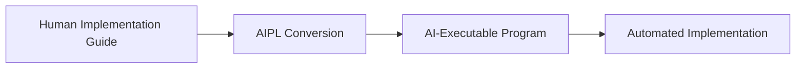
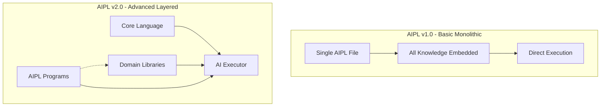
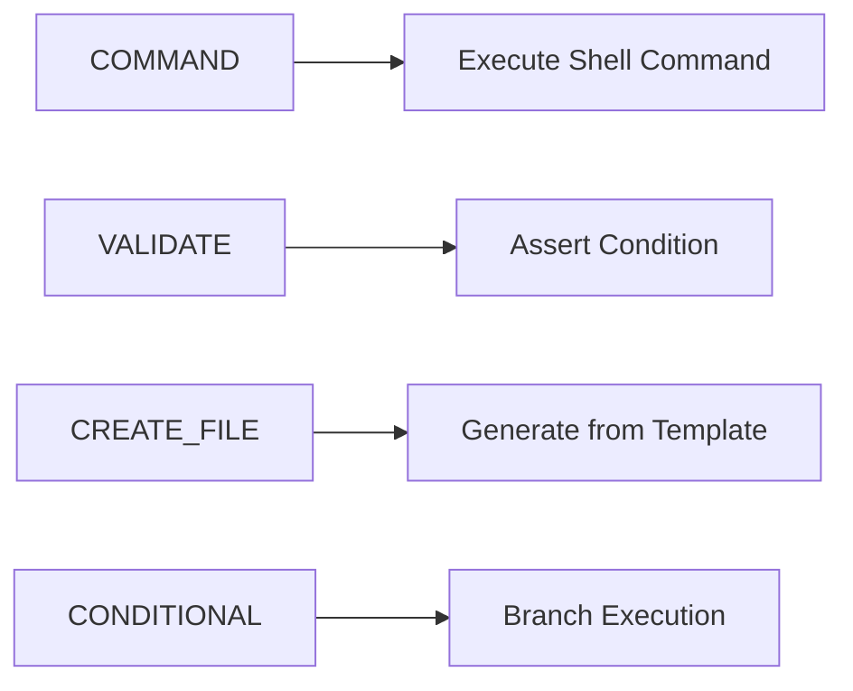
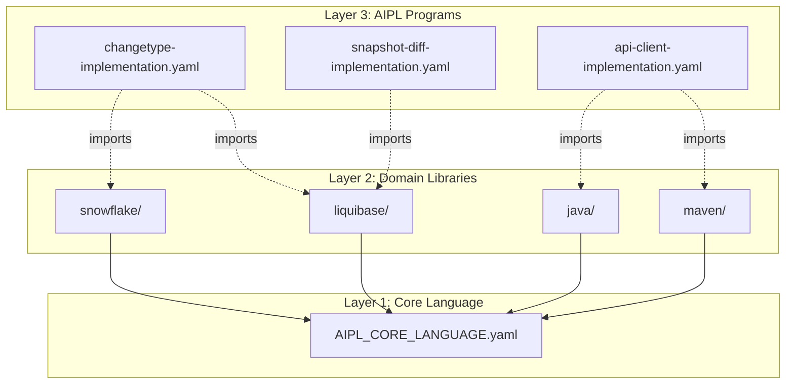
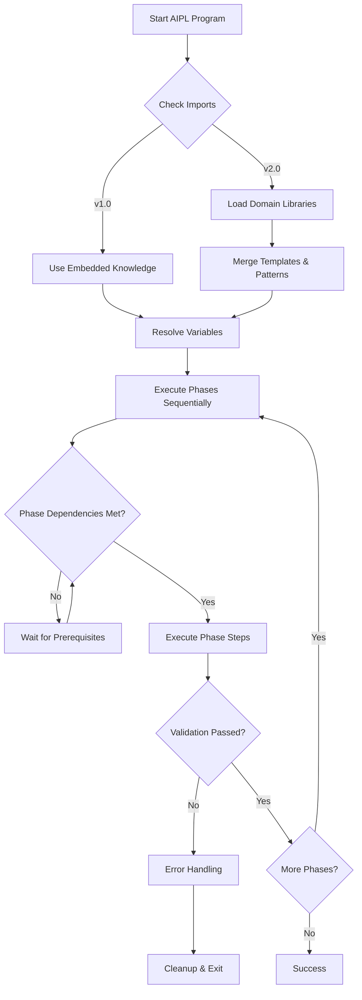

# AIPL User Guide: AI Implementation Programming Language

## Overview

AIPL (AI Implementation Programming Language) is a YAML-based domain-specific language designed to create AI-consumable implementation workflows. It transforms human implementation guides into structured, executable programs that AI can follow with minimal interpretation.

## Core Concept



**Key Principle**: Convert narrative documentation into immediately actionable, structured workflows.

## Architecture Overview

AIPL supports two architectural approaches:



## Basic Approach (AIPL v1.0)

### When to Use
- Simple, linear workflows
- Single technology focus
- Prototypes and learning
- One-off implementations

### Structure
```yaml
AIPL_VERSION: "1.0"
PROGRAM_NAME: "my-implementation"
DESCRIPTION: "What this program does"

VARIABLES:
  OBJECT_TYPE: "Warehouse"
  PACKAGE_BASE: "com.example"

PHASES:
  PHASE_1_SETUP:
    DESCRIPTION: "Setup environment"
    STEPS:
      - COMMAND:
          NAME: "create-directories"
          EXECUTE: "mkdir -p src/main/java/${PACKAGE_BASE}"
      - VALIDATE:
          NAME: "verify-setup"
          TYPE: "DIRECTORY_EXISTS"
          TARGET: "src/main/java/${PACKAGE_BASE}"
          FAILURE_ACTION: "STOP"

TEMPLATES:
  JAVA_CLASS_TEMPLATE: |
    package ${PACKAGE_BASE};
    public class ${OBJECT_TYPE} {
        // Implementation
    }
```

### Basic Step Types


## Advanced Approach (AIPL v2.0)

### When to Use
- Multi-domain workflows
- Reusable patterns
- Enterprise scale
- Long-term maintenance

### Layered Architecture



### Program Structure
```yaml
AIPL_VERSION: "2.0"
PROGRAM_NAME: "changetype-implementation"
DESCRIPTION: "Implement Liquibase changetype with Snowflake support"

IMPORTS:
  - "libraries/liquibase/LIQUIBASE_CORE_PATTERNS.yaml"
  - "libraries/snowflake/SNOWFLAKE_SQL_PATTERNS.yaml"
  - "libraries/maven/MAVEN_BUILD_PATTERNS.yaml"

VARIABLES:
  CHANGETYPE: "CreateWarehouse"
  DATABASE: "Snowflake"

PHASES:
  PHASE_1_ARCHITECTURE:
    STEPS:
      - USE_PATTERN: "LIQUIBASE_ARCHITECTURAL_DECISION"
      - USE_VALIDATION: "ARCHITECTURAL_COMPLIANCE"
      
  PHASE_2_IMPLEMENTATION:
    STEPS:
      - USE_TEMPLATE: "LIQUIBASE_GENERATOR_TEMPLATE"
        VARIABLES:
          OBJECT_TYPE: "${CHANGETYPE}"
          DATABASE_TYPE: "${DATABASE}"
```

### Domain Library Structure
```yaml
LIBRARY_NAME: "liquibase-core-patterns"
LIBRARY_VERSION: "1.0"

PROVIDES:
  VALIDATION_TYPES:
    ARCHITECTURAL_COMPLIANCE:
      # Custom validation logic
      
  STEP_TYPES:
    LIQUIBASE_COMPILE_AND_VALIDATE:
      # Multi-step workflow
      
  TEMPLATES:
    LIQUIBASE_GENERATOR_TEMPLATE: |
      package ${PACKAGE_BASE}.sqlgenerator;
      // Template content with ${VARIABLES}
      
  PATTERNS:
    ARCHITECTURAL_DECISION_PATTERN:
      # Reusable workflow pattern
```

## Execution Flow



## Step Types Reference

### Core Primitives (Available in Both Versions)

| Step Type | Purpose | Example |
|-----------|---------|---------|
| `COMMAND` | Execute shell command | `mvn compile` |
| `VALIDATE` | Assert condition, block on failure | Check file exists |
| `CREATE_FILE` | Generate file from template | Create Java class |
| `CONDITIONAL` | Branch based on condition | If file exists... |
| `CAPTURE` | Store command output in variable | Get current directory |
| `LOOP` | Iterate over collection | Process each file |
| `PARALLEL` | Execute steps concurrently | Run tests in parallel |
| `RETRY` | Re-attempt with backoff | Retry flaky operation |

### Advanced Step Types (v2.0 with Libraries)

| Step Type | Purpose | Source |
|-----------|---------|---------|
| `USE_TEMPLATE` | Apply imported template | Domain library |
| `USE_PATTERN` | Execute imported workflow | Domain library |
| `USE_VALIDATION` | Apply custom validation | Domain library |

## Variable System

### Basic Variables
```yaml
VARIABLES:
  PACKAGE_BASE: "com.example"
  OBJECT_TYPE: "Warehouse"
  
# Usage in templates
package ${PACKAGE_BASE};
public class ${OBJECT_TYPE} { }
```

### Computed Variables
```yaml
VARIABLES:
  BASE_PATH: "src/main/java"
  PACKAGE_PATH: "${BASE_PATH}/${PACKAGE_BASE/\./\/}"
  CLASS_FILE: "${PACKAGE_PATH}/${OBJECT_TYPE}.java"
```

### Built-in Functions
```yaml
# String operations
NAME_UPPER: "upper(${OBJECT_TYPE})"      # WAREHOUSE
NAME_LOWER: "lower(${OBJECT_TYPE})"      # warehouse

# Path operations  
DIR_NAME: "dirname('${FILE_PATH}')"      # Directory part
BASE_NAME: "basename('${FILE_PATH}')"    # Filename part

# System operations
CURRENT_TIME: "timestamp()"              # Current timestamp
UNIQUE_ID: "uuid()"                      # Generate UUID
```

## Validation System

### Basic Validations
```yaml
# File/directory checks
TYPE: "FILE_EXISTS"
TARGET: "${FILE_PATH}"

TYPE: "DIRECTORY_EXISTS" 
TARGET: "${DIR_PATH}"

# Command success
TYPE: "COMMAND_SUCCESS"
COMMAND: "mvn compile"

# Content checks
TYPE: "CONTAINS_TEXT"
TARGET: "${FILE_PATH}"
PATTERN: "${SEARCH_PATTERN}"

# Value comparisons
TYPE: "EQUALS"
LEFT: "${VALUE_1}"
RIGHT: "${VALUE_2}"
```

### Custom Validations (v2.0)
```yaml
# From domain libraries
TYPE: "ARCHITECTURAL_COMPLIANCE"
TYPE: "SERVICE_REGISTRATION_COMPLETE"
TYPE: "SQL_FORMAT_COMPLIANCE"
```

## Error Handling

```yaml
ERROR_HANDLING:
  GLOBAL_FAILURE_ACTION: "STOP"
  
  PHASE_FAILURE_HANDLERS:
    PHASE_BUILD:
      ACTION: "RETRY"
      MAX_ATTEMPTS: 2
      MESSAGE: "Build failed, retrying"
      
  CLEANUP_ON_FAILURE:
    - COMMAND:
        EXECUTE: "git checkout -- ."
        CONTINUE_ON_ERROR: true
    - COMMAND:
        EXECUTE: "mvn clean"
        CONTINUE_ON_ERROR: true
```

## Migration Path


### Migration Steps

1. **Start Basic**: Use v1.0 for initial implementations
2. **Identify Patterns**: Notice repeated templates/workflows
3. **Extract Libraries**: Move reusable content to domain libraries
4. **Upgrade Programs**: Add imports, reference library content
5. **Scale**: Share libraries across multiple programs

## Best Practices

### General
- **Immediate Actionability**: Every block should be immediately executable by AI
- **Boolean Conditions**: All decisions must be reducible to true/false
- **Parameterization**: Use variables for all variable content
- **Validation Gates**: Add blocking validations at critical points

### Basic Approach
- Keep programs focused on single domain
- Embed all necessary knowledge in single file
- Use clear, descriptive variable names
- Include comprehensive error handling

### Advanced Approach  
- Separate domain expertise into libraries
- Design libraries for reusability
- Use imports judiciously (only what you need)
- Version libraries for compatibility

## Common Patterns

### Conditional Implementation
```yaml
CONDITIONAL:
  NAME: "choose-implementation-pattern"
  CONDITION:
    TYPE: "FILE_EXISTS"
    TARGET: "existing-implementation.java"
  THEN:
    - USE_PATTERN: "EXTEND_EXISTING"
  ELSE:
    - USE_PATTERN: "CREATE_NEW"
```

### Build and Test Cycle
```yaml
PARALLEL:
  NAME: "build-and-test"
  WAIT_FOR_ALL: true
  TASKS:
    - COMMAND:
        NAME: "compile"
        EXECUTE: "mvn compile"
    - COMMAND:
        NAME: "run-tests"  
        EXECUTE: "mvn test"
    - COMMAND:
        NAME: "package"
        EXECUTE: "mvn package -DskipTests"
```

### Retry with Fallback
```yaml
RETRY:
  NAME: "primary-approach"
  MAX_ATTEMPTS: 3
  STEP:
    COMMAND:
      EXECUTE: "${PRIMARY_COMMAND}"
  ON_FINAL_FAILURE:
    - COMMAND:
        NAME: "fallback"
        EXECUTE: "${FALLBACK_COMMAND}"
```

## Getting Started

### 1. Choose Your Approach
- **Basic (v1.0)**: Simple workflows, single domain
- **Advanced (v2.0)**: Complex workflows, multiple domains

### 2. Create Your First Program
```yaml
AIPL_VERSION: "1.0"  # or "2.0"
PROGRAM_NAME: "my-first-implementation"
DESCRIPTION: "My first AIPL program"

VARIABLES:
  PROJECT_NAME: "my-project"

PHASES:
  PHASE_1_SETUP:
    DESCRIPTION: "Setup project"
    STEPS:
      - COMMAND:
          NAME: "create-project"
          EXECUTE: "mkdir ${PROJECT_NAME}"
      - VALIDATE:
          NAME: "verify-created"
          TYPE: "DIRECTORY_EXISTS"
          TARGET: "${PROJECT_NAME}"
          FAILURE_ACTION: "STOP"
```

### 3. Run Your Program
Execute your AIPL program using an AIPL-compatible AI system that can:
- Parse YAML structure
- Resolve variables and imports
- Execute commands and validations
- Handle error conditions and cleanup

## Summary

AIPL transforms implementation guides into AI-executable programs through:

- **Structured Format**: YAML-based for programmatic processing
- **Immediate Actionability**: Every block directly executable
- **Variable Parameterization**: Reusable through substitution
- **Validation Gates**: Quality assurance built-in
- **Error Handling**: Robust failure recovery
- **Scalable Architecture**: From simple to enterprise-scale

Choose the approach that fits your complexity needs and scale up as requirements grow.