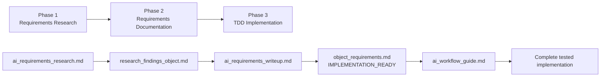
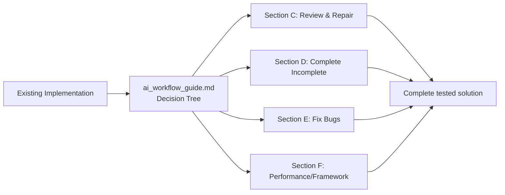

# Liquibase Extension Implementation Guides
## Comprehensive AI-Optimized Workflows for Changetype and Snapshot/Diff Implementation

## IMPLEMENTATION_GUIDES_OVERVIEW
```yaml
PURPOSE: "Comprehensive implementation guides with three-phase workflows and TDD enforcement"
LAST_UPDATED: "2025-08-01"
VERSION: "3.0 - Enhanced with Requirements Research, Documentation, and TDD Implementation phases"
AI_OPTIMIZATION_FEATURES:
  - "Intelligent decision trees for scenario routing"
  - "Sequential blocking execution protocols"
  - "Quality gates and validation checkpoints"
  - "Structured handoff protocols with deliverable templates"
  - "Test-driven development enforcement"
```

## 🎯 QUICK START - WHICH IMPLEMENTATION TYPE DO YOU NEED?

### Changetype Implementation
**USE WHEN**: Implementing database change operations (CREATE, ALTER, DROP statements)
**EXAMPLES**: createWarehouse, alterTable, dropSequence
**ENTRY POINT**: `changetype_implementation/README.md`
**SCENARIOS SUPPORTED**:
- New changetype implementation (8-15 hours)
- Enhance existing changetype (6-12 hours)  
- Review and repair implementation (2-4 hours)
- Complete incomplete implementation (3-5 hours)
- Fix bugs in changetype (1-3 hours)

### Snapshot/Diff Implementation  
**USE WHEN**: Implementing database object introspection and comparison capabilities
**EXAMPLES**: Warehouse snapshots, Table diffs, Schema comparisons
**ENTRY POINT**: `snapshot_diff_implementation/README.md`
**SCENARIOS SUPPORTED**:
- New object snapshot/diff (10-18 hours)
- Enhance existing object (7-13 hours)
- Complete incomplete implementation (5-7 hours)
- Fix bugs in snapshot/diff (2-4 hours)
- Performance optimization (3-5 hours)
- Framework compatibility fixes (2-4 hours)

## 📋 THREE-PHASE WORKFLOW ARCHITECTURE

### Universal Workflow for All New Implementation and Enhancement


### Phase-Specific Workflows for Repair/Fix/Optimization


## 🔍 DETAILED WORKFLOW PHASES

### Phase 1: Requirements Research (2-5 hours)
```yaml
PURPOSE: "Active investigation and discovery of database object capabilities or issues"
ENTRY_POINTS:
  CHANGETYPE: "changetype_implementation/ai_requirements_research.md"
  SNAPSHOT_DIFF: "snapshot_diff_implementation/ai_requirements_research.md"

ACTIVITIES:
  - "Official documentation deep-dive analysis"
  - "SQL syntax discovery and validation against real database"
  - "Parameter/attribute enumeration and testing"
  - "Edge case identification and boundary testing"
  - "Mutual exclusivity rule discovery"
  - "Error condition mapping"

DELIVERABLE: "research_findings_[object].md with all validation checkpoints complete"
QUALITY_GATE: "Must pass all Phase 1 validation before proceeding to Phase 2"
```

### Phase 2: Requirements Documentation (2-4 hours)
```yaml
PURPOSE: "Transform raw research findings into structured, comprehensive requirements documents"
ENTRY_POINTS:
  CHANGETYPE: "changetype_implementation/ai_requirements_writeup.md"
  SNAPSHOT_DIFF: "snapshot_diff_implementation/ai_requirements_writeup.md"

ACTIVITIES:
  - "Research findings validation and gap analysis"
  - "Requirements document structure and template application"
  - "Complete SQL syntax definition and examples (minimum 5)"
  - "Comprehensive attribute analysis table creation (8+ columns)"
  - "Test scenario planning and coverage matrix"
  - "Implementation pattern selection and guidance"

DELIVERABLE: "[object]_requirements.md marked IMPLEMENTATION_READY"
QUALITY_GATE: "Must pass all Phase 2 validation and be marked IMPLEMENTATION_READY before Phase 3"
```

### Phase 3: TDD Implementation (4-10 hours)
```yaml
PURPOSE: "Test-driven development implementation with intelligent decision tree navigation"
ENTRY_POINTS:
  CHANGETYPE: "changetype_implementation/ai_workflow_guide.md" 
  SNAPSHOT_DIFF: "snapshot_diff_implementation/ai_workflow_guide.md"

APPROACH: "RED-GREEN-REFACTOR with strict TDD discipline"
DECISION_TREE: "Intelligent routing based on implementation scenario"

TDD_PHASES:
  RED_PHASE: "Write comprehensive failing tests before any implementation code"
  GREEN_PHASE: "Write minimal implementation to make all tests pass"
  REFACTOR_PHASE: "Improve code quality while maintaining all passing tests"
  INTEGRATION_PHASE: "Validate complete implementation against real database"

DELIVERABLE: "Complete tested implementation with comprehensive coverage"
QUALITY_GATE: "All tests passing + integration validation + requirements satisfied"
```

## 🚨 QUALITY ASSURANCE FRAMEWORK

### Quality Gates Between Phases
```yaml
PHASE_1_TO_2_GATE:
  VALIDATION_SCRIPT: "scripts/validate-phase-1-to-2.sh"
  REQUIREMENTS:
    - "All official documentation sources analyzed (minimum 3)"
    - "All SQL syntax variations tested against real database"
    - "All parameters analyzed with complete details"
    - "All validation checkpoints marked complete"

PHASE_2_TO_3_GATE:
  VALIDATION_SCRIPT: "scripts/validate-phase-2-to-3.sh"
  REQUIREMENTS:
    - "Requirements document marked IMPLEMENTATION_READY"
    - "Minimum 5 SQL examples with comprehensive coverage"
    - "Attribute analysis table with minimum 8 columns"
    - "All test scenarios actionable and comprehensive"

PHASE_3_COMPLETION_GATE:
  VALIDATION_CRITERIA:
    - "All TDD phases completed with validation"
    - "Complete test coverage achieved"
    - "Integration tests successful with realistic criteria"
    - "All requirements fully satisfied"
```

### Handoff Protocols
```yaml
STRUCTURED_HANDOFFS:
  RESEARCH_TO_DOCUMENTATION:
    DELIVERABLE: "research_findings_[object].md"
    VALIDATION: "Quality gate validation script execution"
    ACCEPTANCE: "Phase 2 lead validates completeness"
    
  DOCUMENTATION_TO_IMPLEMENTATION:
    DELIVERABLE: "[object]_requirements.md (IMPLEMENTATION_READY)"
    VALIDATION: "Technical feasibility review"
    ACCEPTANCE: "Phase 3 lead confirms implementation readiness"

HANDOFF_DOCUMENTATION:
  - "Formal handoff records with validation results"
  - "Deliverable assessment and acceptance confirmation"
  - "Success criteria and timeline establishment"
  - "Support and escalation procedures"
```

## 📁 FOLDER STRUCTURE AND NAVIGATION

### Changetype Implementation Folder
```yaml
claude_guide/implementation_guides/changetype_implementation/
├── README.md                           # Navigation and scenario decision tree
├── ai_requirements_research.md         # Phase 1: Requirements research workflow
├── ai_requirements_writeup.md          # Phase 2: Requirements documentation workflow
├── ai_workflow_guide.md                # Phase 3: TDD implementation with decision tree
├── changetype_patterns.md              # Supporting implementation patterns
├── sql_generator_overrides.md          # Supporting SQL override patterns
├── test_harness_guide.md               # Supporting integration testing guide
├── requirements_creation.md            # Legacy - superseded by Phase 1 & 2 workflows
├── master_process_loop_backup.md       # Legacy backup
└── quick_reference.md                  # Fast reference and decision trees
```

### Snapshot/Diff Implementation Folder
```yaml
claude_guide/implementation_guides/snapshot_diff_implementation/
├── README.md                           # Navigation and scenario decision tree
├── ai_requirements_research.md         # Phase 1: Requirements research workflow
├── ai_requirements_writeup.md          # Phase 2: Requirements documentation workflow
├── ai_workflow_guide.md                # Phase 3: TDD implementation with decision tree
├── part1_object_model.md               # Supporting object model patterns
├── part2_snapshot_implementation.md    # Supporting snapshot generator patterns
├── part3_diff_implementation.md        # Supporting comparator and diff patterns
├── part4_testing_guide.md              # Supporting testing strategies
├── part5_reference_implementation.md   # Complete working example
├── error_patterns_guide.md             # Comprehensive error debugging
├── main_guide.md                       # Overview and systematic debugging
├── ai_quickstart_backup.md             # Legacy backup
```

### Quality Assurance Documents
```yaml
claude_guide/implementation_guides/
├── README.md                           # This document - master navigation
├── quality_gates_and_validation.md     # Comprehensive validation framework
└── handoff_protocols_and_templates.md  # Structured handoff protocols
```

## 🎯 IMPLEMENTATION SUCCESS PATTERNS

### For New Implementation (Changetype or Snapshot/Diff)
```yaml
SUCCESS_PATH:
  1. "Identify scenario using README decision tree"
  2. "Execute Phase 1: Complete thorough research with database validation"
  3. "Execute Phase 2: Create comprehensive requirements marked IMPLEMENTATION_READY"
  4. "Execute Phase 3: Follow TDD discipline with RED-GREEN-REFACTOR"
  5. "Validate integration with realistic success criteria"

TIME_INVESTMENT:
  CHANGETYPE: "8-15 hours total (2-4 + 2-3 + 4-8 hours)"
  SNAPSHOT_DIFF: "10-18 hours total (3-5 + 3-4 + 6-10 hours)"

SUCCESS_INDICATORS:
  - "All quality gates passed without compromise"
  - "Complete test coverage with all tests passing"
  - "Integration validation successful"
  - "Requirements fully satisfied with documented evidence"
```

### For Repair/Fix/Optimization
```yaml
SUCCESS_PATH:
  1. "Identify scenario using README decision tree"
  2. "Go directly to Phase 3: ai_workflow_guide.md with appropriate section"
  3. "Follow TDD repair/fix workflow specific to issue type"
  4. "Validate solution with comprehensive testing"

TIME_INVESTMENT:
  REPAIR: "2-4 hours"
  COMPLETION: "3-7 hours"
  BUG_FIX: "1-4 hours"
  OPTIMIZATION: "2-5 hours"

SUCCESS_INDICATORS:
  - "Original issues completely resolved"
  - "No regressions introduced"
  - "All tests passing with improved coverage"
  - "Implementation meets original requirements"
```

## 🚀 GETTING STARTED CHECKLIST

### For Your First Implementation
1. [ ] **Identify Implementation Type**: Changetype or Snapshot/Diff?
2. [ ] **Identify Scenario**: New, Enhancement, Repair, Fix, or Optimization?
3. [ ] **Navigate to Appropriate Folder**: Use scenario decision trees
4. [ ] **Follow Phase Workflow**: Complete all phases with quality gates
5. [ ] **Use TDD Discipline**: RED-GREEN-REFACTOR throughout Phase 3
6. [ ] **Validate Integration**: Ensure realistic success criteria met

### For Experienced Implementers
1. [ ] **Review Updates**: Check for any process or template improvements
2. [ ] **Validate Prerequisites**: Ensure environment and tools ready
3. [ ] **Execute Workflow**: Follow appropriate phase sequence
4. [ ] **Apply Best Practices**: Use quality gates and handoff protocols
5. [ ] **Document Learnings**: Contribute improvements back to guides

## 🎉 KEY ENHANCEMENTS IN VERSION 3.0

### Three-Phase Architecture
- **Clear Separation**: Research → Documentation → Implementation
- **Quality Gates**: Comprehensive validation between phases
- **Handoff Protocols**: Structured transitions with deliverable templates

### AI-Optimized Workflows
- **Intelligent Decision Trees**: Route to appropriate workflow based on scenario
- **Sequential Blocking Execution**: Prevent step-skipping with validation checkpoints
- **TDD Enforcement**: Test-first development throughout implementation

### Comprehensive Quality Framework
- **Automated Validation**: Scripts validate deliverables against quality standards
- **Realistic Success Criteria**: Framework-aware expectations and validation approaches
- **Systematic Debugging**: 5-layer analysis with field-tested error patterns

### Enhanced User Experience
- **Scenario-Based Navigation**: Clear paths for all implementation scenarios
- **Time Estimates**: Realistic duration expectations for all workflows
- **Success Patterns**: Proven approaches for different implementation types

Remember: **These implementation guides are designed to ensure comprehensive, correct implementations through systematic workflows, quality assurance, and test-driven development**. The investment in following the complete three-phase workflow for new implementations pays dividends in implementation quality, completeness, and long-term maintainability.