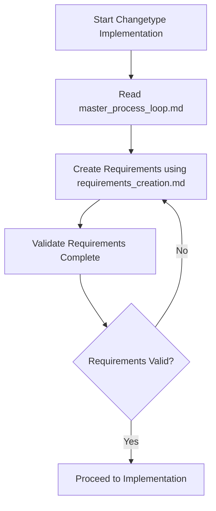
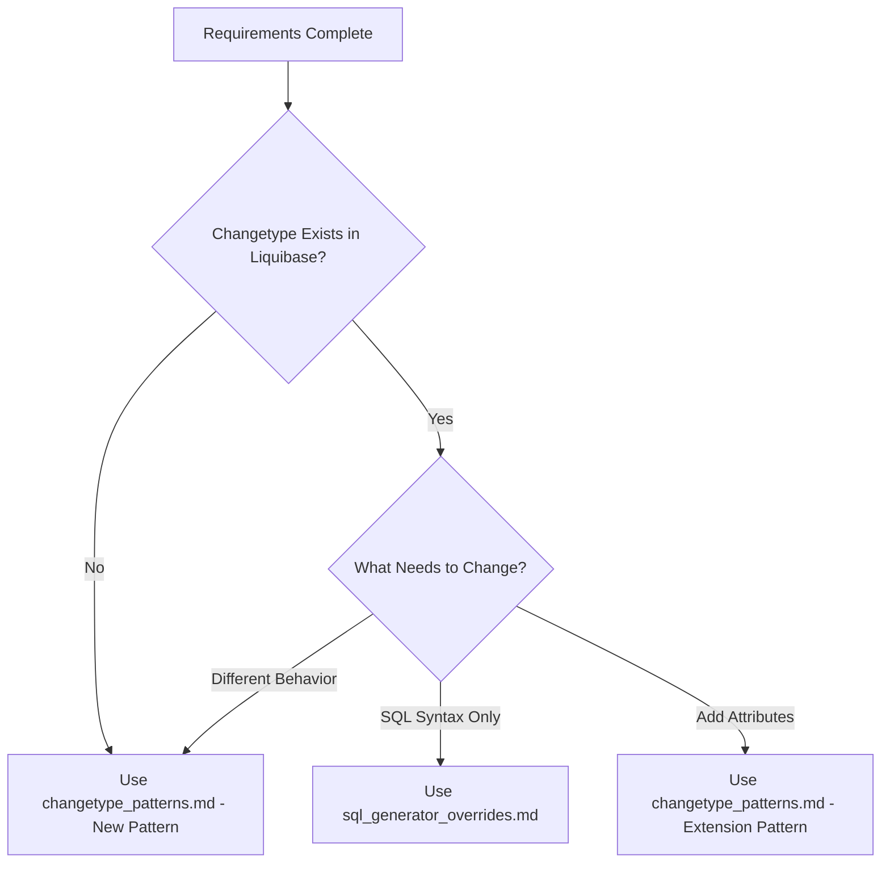
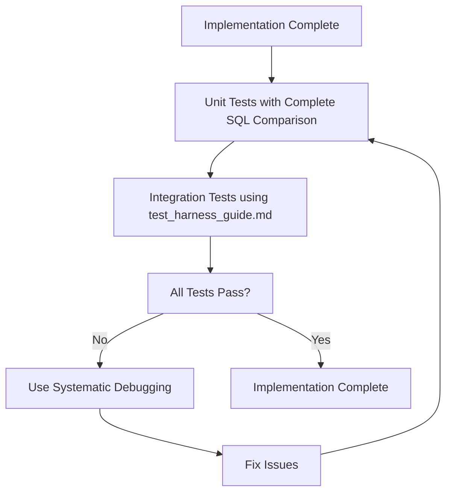

# Changetype Implementation Guide
## Navigation and Quick Start for Liquibase Changetype Development

## FOLDER_OVERVIEW
```yaml
PURPOSE: "AI-optimized guides for implementing Liquibase changetype functionality"
UPDATED: "Enhanced with sequential blocking execution and core issue prevention"
ADDRESSES_CORE_ISSUES:
  - "Complete syntax definition"
  - "Complete SQL test statements"
  - "Unit tests complete string comparison"
  - "Integration tests ALL generated SQL"
```

## 🚀 INTELLIGENT WORKFLOW - WHAT ARE YOU TRYING TO ACCOMPLISH?

### 🎯 START HERE: What Is Your Implementation Scenario?

**SCENARIO A - NEW IMPLEMENTATION**: Implement a completely new changetype from scratch
→ **WORKFLOW**: Phase 1 → Phase 2 → Phase 3 (Full 3-phase workflow)
→ **START**: `ai_requirements_research.md`
→ **DURATION**: 8-15 hours total

**SCENARIO B - ENHANCE EXISTING**: Add database-specific attributes to existing changetype  
→ **WORKFLOW**: Phase 1 → Phase 2 → Phase 3 (Full 3-phase workflow)
→ **START**: `ai_requirements_research.md`
→ **DURATION**: 6-12 hours total

**SCENARIO C - REVIEW AND REPAIR**: Review and repair existing implementation with issues
→ **WORKFLOW**: Phase 3 only (TDD repair workflow)
→ **START**: `ai_workflow_guide.md` → Section C
→ **DURATION**: 2-4 hours

**SCENARIO D - COMPLETE INCOMPLETE**: Complete an incomplete changetype implementation
→ **WORKFLOW**: Phase 3 only (TDD completion workflow)  
→ **START**: `ai_workflow_guide.md` → Section D
→ **DURATION**: 3-5 hours

**SCENARIO E - FIX BUGS**: Fix bugs in existing changetype implementation
→ **WORKFLOW**: Phase 3 only (TDD bug fix workflow)
→ **START**: `ai_workflow_guide.md` → Section E
→ **DURATION**: 1-3 hours

## 📋 THREE-PHASE WORKFLOW (For New Implementation and Enhancement)

### Phase 1: Requirements Research (MUST DO FIRST)
**ENTRY POINT**: `ai_requirements_research.md`
**PURPOSE**: Active investigation and discovery of database object capabilities
**DELIVERABLE**: `research_findings_[object].md`
**DURATION**: 2-4 hours
**QUALITY GATE**: All validation checkpoints complete before Phase 2

### Phase 2: Requirements Documentation (MUST DO SECOND)  
**ENTRY POINT**: `ai_requirements_writeup.md`
**PURPOSE**: Transform research findings into impeccable requirements documents
**DELIVERABLE**: `[object]_requirements.md (IMPLEMENTATION_READY)`
**DURATION**: 2-3 hours
**QUALITY GATE**: Document marked IMPLEMENTATION_READY before Phase 3

### Phase 3: TDD Implementation (MUST DO THIRD)
**ENTRY POINT**: `ai_workflow_guide.md`
**PURPOSE**: Test-driven development implementation with decision tree navigation
**DELIVERABLE**: Complete tested changetype implementation
**DURATION**: 4-8 hours
**APPROACH**: RED-GREEN-REFACTOR with strict TDD discipline

## 📁 ENHANCED DOCUMENT STRUCTURE

### Phase Workflow Documents (MAIN ENTRY POINTS)
```yaml
ai_requirements_research.md:
  PURPOSE: "Phase 1 - Active investigation and discovery workflow"
  WHEN_TO_USE: "Starting new implementation or enhancement"
  DELIVERABLE: "research_findings_[object].md"
  DURATION: "2-4 hours focused research"

ai_requirements_writeup.md:
  PURPOSE: "Phase 2 - Transform research into impeccable requirements"
  WHEN_TO_USE: "After Phase 1 research complete"
  INPUT_REQUIRED: "research_findings_[object].md"
  DELIVERABLE: "[object]_requirements.md (IMPLEMENTATION_READY)"

ai_workflow_guide.md:
  PURPOSE: "Phase 3 - TDD implementation with intelligent decision tree"
  WHEN_TO_USE: "After Phase 2 requirements ready OR for repair/fix scenarios"
  INPUT_REQUIRED: "[object]_requirements.md (for new/enhance) OR existing implementation (for repair/fix)"
  APPROACH: "RED-GREEN-REFACTOR with strict TDD discipline"
```

### Supporting Implementation Pattern Documents
```yaml
changetype_patterns.md:
  PURPOSE: "Implementation patterns referenced by Phase 3 workflow"
  WHEN_TO_READ: "Referenced automatically by ai_workflow_guide.md"
  USAGE: "Support document for specific implementation patterns"

sql_generator_overrides.md:
  PURPOSE: "SQL override patterns referenced by Phase 3 workflow"
  WHEN_TO_READ: "Referenced automatically by ai_workflow_guide.md"
  USAGE: "Support document for SQL syntax override scenarios"

test_harness_guide.md:
  PURPOSE: "Integration testing referenced by Phase 3 workflow"
  WHEN_TO_READ: "Referenced automatically during integration testing phase"
  USAGE: "Support document for test harness setup and validation"
```

### Quality Assurance and Process Documents
```yaml
quality_gates_and_validation.md:
  PURPOSE: "Comprehensive validation framework for phase transitions"
  USAGE: "Automated validation of deliverables between phases"

handoff_protocols_and_templates.md:
  PURPOSE: "Structured handoff protocols with deliverable templates"
  USAGE: "Ensures clean transitions between phases with complete deliverables"

quick_reference.md:
  PURPOSE: "Fast reference for common tasks and decision trees"
  USAGE: "Quick lookup during implementation"
```

## 🎯 IMPLEMENTATION FLOW

### Phase 1: Planning and Requirements


### Phase 2: Implementation Pattern Selection


### Phase 3: Testing and Validation


## 🛠️ COMMON WORKFLOWS

### Workflow 1: New Database Object
```bash
# 1. Requirements Research
./scripts/validate-requirements.sh [changeType]

# 2. Implementation
cd liquibase-[database]
# Follow changetype_patterns.md - New Changetype Pattern

# 3. Testing
mvn clean install -DskipTests
cd ../liquibase-test-harness
mvn test -Dtest=ChangeObjectTests -DchangeObjects=[changeType] -DdbName=[database]
```

### Workflow 2: SQL Syntax Override
```bash
# 1. Requirements Research (SQL syntax focused)
# Follow requirements_creation.md for SQL syntax research

# 2. Implementation
# Follow sql_generator_overrides.md

# 3. Testing
./scripts/sql-generator-workflow.sh [database] [changeType] [operation]
```

### Workflow 3: Add Database-Specific Attributes
```bash
# 1. Requirements Research (attribute focused)
# Follow requirements_creation.md for attribute analysis

# 2. Implementation
# Follow changetype_patterns.md - Extension Pattern

# 3. Testing  
./scripts/extend-changetype-workflow.sh [changeType] [database] [attributes]
```

## 🚨 CRITICAL SUCCESS FACTORS

### Before Starting ANY Implementation
```yaml
MANDATORY_PRECONDITIONS:
  - "Requirements document exists and is complete"
  - "Official documentation researched and referenced"
  - "Complete SQL syntax examples documented"
  - "All attributes analyzed and categorized"
  - "Test scenarios planned"
  - "Mutual exclusivity rules identified"
```

### During Implementation
```yaml
SEQUENTIAL_BLOCKING_RULES:
  - "Complete each validation checkpoint before proceeding"
  - "Test each phase before moving to next"
  - "Use complete SQL string comparison in ALL unit tests"
  - "Cover ALL SQL generation scenarios in integration tests"
  - "Apply systematic debugging when issues arise"
```

### Before Claiming Completion
```yaml
COMPLETION_GATES:
  - "All unit tests pass with complete SQL validation"
  - "Integration tests cover ALL generated SQL scenarios"
  - "Test harness passes with comprehensive coverage"
  - "Systematic debugging applied to any failures"
  - "Requirements coverage verified"
```

## 🔧 DEBUGGING AND TROUBLESHOOTING

### When Things Go Wrong
1. **DON'T ASSUME** where the bug is
2. **USE SYSTEMATIC DEBUGGING** from master_process_loop.md
3. **CONSULT ERROR PATTERNS**: `../snapshot_diff_implementation/error_patterns_guide.md`
4. **APPLY 5-LAYER ANALYSIS**: Code → Registration → Execution → Data → Framework
5. **FIX ROOT CAUSE**: Don't change requirements to fit code

### Common Issues and Solutions
```yaml
BUILD_FAILURES:
  - "Check service registration files"
  - "Verify Maven dependencies"
  - "Use mvn clean install not mvn package"

TEST_FAILURES:
  - "Use systematic debugging protocol"
  - "Check complete SQL string comparison"
  - "Verify test harness configuration"
  - "Validate schema isolation setup"

SQL_GENERATION_ISSUES:
  - "Review requirements document"
  - "Check generator priority"
  - "Validate complete SQL generation"
  - "Test all property combinations"
```

## 🔗 CROSS-REFERENCES

### Related Implementation Guides
```yaml
SNAPSHOT_DIFF_GUIDES:
  BASE_PATH: "../snapshot_diff_implementation/"
  KEY_DOCUMENTS:
    - "ai_quickstart.md": "Sequential execution patterns"
    - "error_patterns_guide.md": "Systematic debugging framework"
    - "main_guide.md": "5-layer debugging approach"
```

### Automated Scripts
```yaml
WORKFLOW_SCRIPTS:
  - "scripts/new-changetype-workflow.sh": "Complete new changetype implementation"
  - "scripts/sql-generator-workflow.sh": "SQL override implementation and testing"
  - "scripts/extend-changetype-workflow.sh": "Existing changetype extension"
  - "scripts/test-harness-workflow.sh": "Test harness execution and validation"
  - "scripts/validate-requirements.sh": "Requirements document validation"
```

## 📊 SUCCESS METRICS

### Implementation Quality Indicators
```yaml
REQUIREMENTS_QUALITY:
  - "Official documentation referenced"
  - "5+ complete SQL examples provided"
  - "All attributes categorized properly"
  - "Test scenarios comprehensively planned"

IMPLEMENTATION_QUALITY:
  - "All unit tests use complete SQL string comparison"
  - "Integration tests cover ALL SQL generation paths"
  - "Service registration complete and correct"
  - "Generator priority properly configured"

TESTING_QUALITY:
  - "Test harness passes with comprehensive coverage"
  - "Schema isolation working correctly"
  - "All property combinations tested"
  - "Edge cases and error conditions covered"
```

## 🎯 QUALITY GATES

### Gate 1: Requirements Complete
- [ ] Requirements document exists
- [ ] Official documentation researched
- [ ] Complete SQL syntax documented
- [ ] All attributes analyzed
- [ ] Test scenarios planned

### Gate 2: Implementation Complete
- [ ] All required classes implemented
- [ ] Service registration complete
- [ ] Unit tests pass with complete SQL comparison
- [ ] Generator produces complete SQL

### Gate 3: Integration Complete
- [ ] Test harness files created
- [ ] Integration tests pass
- [ ] All SQL scenarios covered
- [ ] Systematic debugging applied

### Gate 4: Validation Complete
- [ ] Requirements coverage verified
- [ ] All four core issues addressed
- [ ] Documentation updated with learnings
- [ ] Success criteria met

## 🚀 GETTING STARTED CHECKLIST

### For Your First Changetype Implementation
1. [ ] Read `master_process_loop.md` completely
2. [ ] Understand the sequential blocking execution protocol
3. [ ] Set up automated workflow scripts
4. [ ] Create requirements document using `requirements_creation.md`
5. [ ] Choose implementation pattern from `changetype_patterns.md`
6. [ ] Set up testing environment per `test_harness_guide.md`
7. [ ] Execute implementation following validation checkpoints
8. [ ] Apply systematic debugging when needed

### For Experienced Implementers
1. [ ] Review any updates to core processes
2. [ ] Validate requirements document completeness
3. [ ] Execute implementation with checkpoint validation
4. [ ] Use automated scripts for consistency
5. [ ] Apply learnings to improve documentation

Remember: These guides are AI-optimized to prevent step-skipping and goalpost changing. Follow the sequential blocking execution protocol for best results!