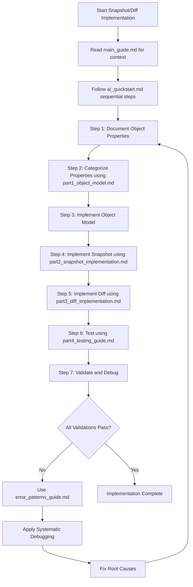
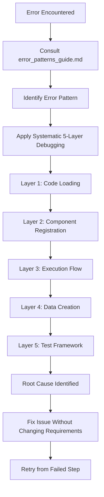

# Snapshot/Diff Implementation Guide
## Navigation and Quick Start for Liquibase Snapshot and Diff Capabilities

## FOLDER_OVERVIEW
```yaml
PURPOSE: "AI-optimized guides for implementing Liquibase snapshot and diff capabilities"
UPDATED: "Enhanced with sequential blocking execution and comprehensive error prevention"
ADDRESSES_CORE_ISSUES:
  - "Complete syntax definition through systematic object modeling"
  - "Complete SQL test statements through snapshot SQL validation"
  - "Unit tests complete string comparison through exact object comparison"
  - "Integration tests ALL generated SQL through comprehensive test harness validation"
  - "Realistic success criteria based on framework limitations"
```

## 🚀 INTELLIGENT WORKFLOW - WHAT ARE YOU TRYING TO ACCOMPLISH?

### 🎯 START HERE: What Is Your Snapshot/Diff Implementation Scenario?

**SCENARIO A - NEW OBJECT**: Implement snapshot/diff for a completely new database object
→ **WORKFLOW**: Phase 1 → Phase 2 → Phase 3 (Full 3-phase workflow)
→ **START**: `ai_requirements_research.md`
→ **DURATION**: 10-18 hours total

**SCENARIO B - ENHANCE EXISTING**: Enhance existing object snapshot/diff with additional properties
→ **WORKFLOW**: Phase 1 → Phase 2 → Phase 3 (Full 3-phase workflow)
→ **START**: `ai_requirements_research.md`
→ **DURATION**: 7-13 hours total

**SCENARIO C - COMPLETE INCOMPLETE**: Complete an incomplete snapshot/diff implementation
→ **WORKFLOW**: Phase 3 only (TDD completion workflow)
→ **START**: `ai_workflow_guide.md` → Section C
→ **DURATION**: 5-7 hours

**SCENARIO D - FIX BUGS**: Fix bugs in existing snapshot/diff implementation
→ **WORKFLOW**: Phase 3 only (TDD bug fix workflow)
→ **START**: `ai_workflow_guide.md` → Section D
→ **DURATION**: 2-4 hours

**SCENARIO E - PERFORMANCE OPTIMIZATION**: Optimize performance of existing implementation
→ **WORKFLOW**: Phase 3 only (TDD optimization workflow)
→ **START**: `ai_workflow_guide.md` → Section E
→ **DURATION**: 3-5 hours

**SCENARIO F - FRAMEWORK COMPATIBILITY**: Fix framework integration or test harness compatibility
→ **WORKFLOW**: Phase 3 only (TDD framework compatibility workflow)
→ **START**: `ai_workflow_guide.md` → Section F
→ **DURATION**: 2-4 hours

## 📋 THREE-PHASE WORKFLOW (For New Object and Enhancement)

### Phase 1: Requirements Research (MUST DO FIRST)
**ENTRY POINT**: `ai_requirements_research.md`
**PURPOSE**: Active investigation and discovery of database object structure and behavior
**DELIVERABLE**: `research_findings_[object]_snapshot_diff.md`
**DURATION**: 3-5 hours
**QUALITY GATE**: All validation checkpoints complete before Phase 2

### Phase 2: Requirements Documentation (MUST DO SECOND)
**ENTRY POINT**: `ai_requirements_writeup.md`
**PURPOSE**: Transform research findings into impeccable snapshot/diff requirements documents
**DELIVERABLE**: `[object]_snapshot_diff_requirements.md (IMPLEMENTATION_READY)`
**DURATION**: 3-4 hours
**QUALITY GATE**: Document marked IMPLEMENTATION_READY before Phase 3

### Phase 3: TDD Implementation (MUST DO THIRD)
**ENTRY POINT**: `ai_workflow_guide.md`
**PURPOSE**: Test-driven development implementation with decision tree navigation
**DELIVERABLE**: Complete tested snapshot/diff implementation
**DURATION**: 6-10 hours
**APPROACH**: RED-GREEN-REFACTOR with strict TDD discipline and framework scope validation

## 📁 ENHANCED DOCUMENT STRUCTURE

### Phase Workflow Documents (MAIN ENTRY POINTS)
```yaml
ai_requirements_research.md:
  PURPOSE: "Phase 1 - Active investigation and discovery of database object structure"
  WHEN_TO_USE: "Starting new object or enhancement implementation"
  DELIVERABLE: "research_findings_[object]_snapshot_diff.md"
  DURATION: "3-5 hours focused research"

ai_requirements_writeup.md:
  PURPOSE: "Phase 2 - Transform research into impeccable snapshot/diff requirements"
  WHEN_TO_USE: "After Phase 1 research complete"
  INPUT_REQUIRED: "research_findings_[object]_snapshot_diff.md"
  DELIVERABLE: "[object]_snapshot_diff_requirements.md (IMPLEMENTATION_READY)"

ai_workflow_guide.md:
  PURPOSE: "Phase 3 - TDD implementation with intelligent decision tree"
  WHEN_TO_USE: "After Phase 2 requirements ready OR for repair/fix/optimization scenarios"
  INPUT_REQUIRED: "[object]_snapshot_diff_requirements.md (for new/enhance) OR existing implementation (for repair/fix)"
  APPROACH: "RED-GREEN-REFACTOR with framework scope validation"
```

### Supporting Implementation Pattern Documents
```yaml
part1_object_model.md:
  PURPOSE: "Database object model patterns referenced by Phase 3 workflow"
  WHEN_TO_READ: "Referenced automatically by ai_workflow_guide.md"
  USAGE: "Support document for object model implementation"

part2_snapshot_implementation.md:
  PURPOSE: "SnapshotGenerator patterns referenced by Phase 3 workflow"
  WHEN_TO_READ: "Referenced automatically by ai_workflow_guide.md"
  USAGE: "Support document for snapshot SQL and generator implementation"

part3_diff_implementation.md:
  PURPOSE: "Comparator and diff patterns referenced by Phase 3 workflow"
  WHEN_TO_READ: "Referenced automatically by ai_workflow_guide.md"
  USAGE: "Support document for comparison logic and diff generation"

part4_testing_guide.md:
  PURPOSE: "Testing strategies referenced by Phase 3 workflow"
  WHEN_TO_READ: "Referenced automatically during integration testing phase"
  USAGE: "Support document for test harness limitations and realistic success criteria"

part5_reference_implementation.md:
  PURPOSE: "Complete working example for reference"
  WHEN_TO_READ: "When need working implementation patterns"
  USAGE: "Reference document with field-tested implementation patterns"
```

### Debugging and Quality Documents
```yaml
error_patterns_guide.md:
  PURPOSE: "Comprehensive error debugging with systematic approach"
  WHEN_TO_READ: "When encountering any implementation issues"
  USAGE: "5-layer debugging framework with field-tested solutions"

main_guide.md:
  PURPOSE: "Overview and systematic debugging framework"
  WHEN_TO_READ: "Need context or encountering systematic issues"
  USAGE: "Background understanding and systematic troubleshooting"

quality_gates_and_validation.md:
  PURPOSE: "Comprehensive validation framework for phase transitions"
  USAGE: "Automated validation of deliverables between phases"

handoff_protocols_and_templates.md:
  PURPOSE: "Structured handoff protocols with deliverable templates"
  USAGE: "Ensures clean transitions between phases with complete deliverables"
```

## 🎯 IMPLEMENTATION FLOW

### Recommended Implementation Sequence


### Error Recovery Flow


## 🛠️ COMMON WORKFLOWS

### Workflow 1: Complete New Object Implementation
```bash
# 1. Setup and Planning
./scripts/snapshot-diff-workflow.sh [database] [objectType]

# 2. Sequential Implementation
# Follow ai_quickstart.md steps 1-7 with validation checkpoints

# 3. Testing and Validation
cd liquibase-test-harness
mvn test -Dtest=SnapshotObjectTests -DdbName=[database] -DsnapshotObjects=[objectType]
```

### Workflow 2: Debug Existing Implementation
```bash
# 1. Identify Error Pattern
# Consult error_patterns_guide.md

# 2. Apply Systematic Debugging
# Follow 5-layer analysis framework

# 3. Fix and Validate
./scripts/snapshot-diff-debug-workflow.sh [database] [testname]
```

### Workflow 3: Validate Framework Compatibility
```bash
# 1. Test Harness Scope Validation (Step 6.0)
mvn test -Dtest=SnapshotObjectTests -DdbName=[database] -DsnapshotObjects=createTable

# 2. Check Custom Object Inclusion
grep -i "includedType.*[ObjectType]" test-output.log

# 3. Set Realistic Success Criteria
# Document scope limitations in test_harness_scope.md
```

## 🚨 CRITICAL SUCCESS FACTORS

### Before Starting Implementation
```yaml
MANDATORY_PRECONDITIONS:
  - "Complete requirements document with all object properties"
  - "Property categorization (Required/Optional/State)"
  - "Official database documentation researched"
  - "Test harness scope validated (Step 6.0)"
  - "Realistic success criteria established"
```

### During Implementation (Sequential Blocking)
```yaml
VALIDATION_CHECKPOINTS:
  STEP_1: "All properties documented and verified"
  STEP_2: "Property categories complete and validated"
  STEP_3: "Object model implementation complete"
  STEP_4: "Snapshot implementation with SQL validation"
  STEP_5: "Diff implementation with comparison logic"
  STEP_6: "Test harness scope validated"
  STEP_7: "All tests passing with realistic criteria"
```

### Framework Limitation Awareness
```yaml
CRITICAL_UNDERSTANDING:
  TEST_HARNESS_SCOPE:
    - "Custom objects may not be included in default snapshot scope"
    - "Must validate scope before setting expectations"
    - "Success criteria must be realistic based on framework capabilities"
  
  SERVICE_REGISTRATION:
    - "META-INF/services/liquibase.structure.DatabaseObject registration required"
    - "Without registration, objects won't appear in snapshots"
    - "Registration determines scope inclusion"
```

## 🔧 DEBUGGING AND TROUBLESHOOTING

### When Implementation Fails
1. **STOP AND CONSULT**: `error_patterns_guide.md`
2. **IDENTIFY PATTERN**: Match your error to documented patterns
3. **APPLY SYSTEMATIC DEBUGGING**: Use 5-layer analysis framework
4. **NO GOALPOST CHANGING**: Fix issues without redefining requirements
5. **VALIDATE FIX**: Ensure complete resolution before proceeding

### Common Issue Categories
```yaml
SERVICE_REGISTRATION_ISSUES:
  SYMPTOMS: "No snapshot generator found for type [ObjectType]"
  SOLUTION: "Check META-INF/services files and registration"
  REFERENCE: "error_patterns_guide.md - Pattern #1"

DATABASE_STATE_PERSISTENCE:
  SYMPTOMS: "Database is up to date, no changesets to execute"
  SOLUTION: "Add runAlways='true' cleanup changesets"
  REFERENCE: "error_patterns_guide.md - Pattern #2"

OBJECTS_NOT_IN_SNAPSHOT:
  SYMPTOMS: "Expected: [ObjectType] objects but none found"
  SOLUTION: "Validate scope and adjust success criteria"
  REFERENCE: "error_patterns_guide.md - Pattern #3"

JSON_FORMAT_MISMATCHES:
  SYMPTOMS: "JSONAssert.assertEquals() failed"
  SOLUTION: "Remove database metadata, match working format"
  REFERENCE: "error_patterns_guide.md - Pattern #5"
```

## 🎯 FRAMEWORK LIMITATIONS AND REALISTIC EXPECTATIONS

### Test Harness Scope Limitations
```yaml
CRITICAL_LIMITATION:
  ISSUE: "Custom database objects may not be included in snapshot scope"
  IMPACT: "Tests may fail for wrong reasons if scope not understood"
  SOLUTION: "Validate scope in Step 6.0 before writing tests"
  
REALISTIC_SUCCESS_CRITERIA:
  IF_IN_SCOPE:
    SUCCESS: "Full test harness pass with snapshot validation"
  IF_NOT_IN_SCOPE:
    SUCCESS: "Changesets execute + objects created in DB + manual verification"
    DOCUMENTATION: "Create test_harness_scope.md documenting limitations"
```

### Service Registration Requirements
```yaml
CRITICAL_REQUIREMENT:
  REGISTRATION: "META-INF/services/liquibase.structure.DatabaseObject"
  PURPOSE: "Required for objects to be included in default snapshots"
  WITHOUT_REGISTRATION: "Custom objects will not appear in snapshot scope"
  VALIDATION: "Check service registration before expecting snapshot inclusion"
```

## 🔗 CROSS-REFERENCES

### Related Changetype Guides
```yaml
COMPANION_IMPLEMENTATION_GUIDES:
  BASE_PATH: "../changetype_implementation/"
  KEY_DOCUMENTS:
    - "master_process_loop.md": "Overall development process"
    - "requirements_creation.md": "Requirements specification process"
    - "error_patterns_guide.md": "Systematic debugging patterns"
```

### Automated Scripts
```yaml
WORKFLOW_SCRIPTS:
  - "scripts/snapshot-diff-workflow.sh": "Complete implementation workflow"
  - "scripts/snapshot-diff-debug-workflow.sh": "Debug workflow with validation"
  - "scripts/validate-scope.sh": "Test harness scope validation"
```

## 📊 SUCCESS METRICS AND QUALITY GATES

### Implementation Quality Indicators
```yaml
REQUIREMENTS_QUALITY:
  - "All object properties documented with complete details"
  - "Property categories clearly defined (Required/Optional/State)"
  - "State properties properly excluded from comparisons"
  - "Official documentation referenced and validated"

IMPLEMENTATION_QUALITY:
  - "Object model handles all documented properties"
  - "Snapshot generator produces complete SQL"
  - "Diff implementation covers all comparison scenarios"
  - "Service registration complete and correct"

TESTING_QUALITY:
  - "Test harness scope validated and documented"
  - "Success criteria realistic based on framework capabilities"
  - "All comparison scenarios tested"
  - "Edge cases and error conditions covered"
```

### Quality Gates
```yaml
GATE_1_REQUIREMENTS:
  - [ ] "Complete object property documentation"
  - [ ] "Property categorization with state exclusion"
  - [ ] "Official documentation research complete"

GATE_2_IMPLEMENTATION:  
  - [ ] "Object model implementation complete"
  - [ ] "Snapshot generator with complete SQL"
  - [ ] "Diff implementation with proper comparison"
  - [ ] "Service registration complete"

GATE_3_TESTING:
  - [ ] "Test harness scope validated"
  - [ ] "Realistic success criteria established"
  - [ ] "Test implementation complete"
  - [ ] "Systematic debugging applied to failures"

GATE_4_VALIDATION:
  - [ ] "All validation checkpoints passed"
  - [ ] "Framework limitations documented"
  - [ ] "Success criteria met realistically"
  - [ ] "Learning integration complete"
```

## 🚀 GETTING STARTED CHECKLIST

### For Your First Snapshot/Diff Implementation
1. [ ] Read `main_guide.md` for overview and context
2. [ ] Understand framework limitations and realistic expectations
3. [ ] Set up automated workflow scripts
4. [ ] Follow `ai_quickstart.md` sequential steps with validation
5. [ ] Validate test harness scope in Step 6.0
6. [ ] Set realistic success criteria based on scope validation
7. [ ] Apply systematic debugging when issues arise
8. [ ] Document limitations and learnings

### For Experienced Implementers
1. [ ] Review any updates to error patterns and solutions
2. [ ] Validate test harness scope for new object types
3. [ ] Execute implementation with checkpoint validation
4. [ ] Use systematic debugging framework for issues
5. [ ] Contribute learnings back to error pattern library

### When Debugging Issues
1. [ ] **STOP** and consult `error_patterns_guide.md` first
2. [ ] Identify matching error pattern
3. [ ] Apply 5-layer systematic debugging framework
4. [ ] Fix root cause without changing requirements
5. [ ] Validate complete resolution
6. [ ] Document new patterns if not covered

## 🎉 KEY IMPROVEMENTS IN THIS VERSION

### Sequential Blocking Execution
- Validation checkpoints prevent step-skipping
- Each step blocks until validation complete
- Systematic approach prevents confusion

### Realistic Success Criteria
- Framework limitations explicitly documented
- Test harness scope validation required
- Success criteria adjusted based on capabilities

### Comprehensive Error Prevention
- Field-tested error patterns documented
- 5-layer systematic debugging framework
- Prevents goalpost changing during debugging

### AI-Optimized Structure
- YAML metadata for AI parsing
- Cross-reference navigation
- Structured validation protocols

Remember: These guides incorporate field-tested learnings and are designed to prevent the common issues that cause Claude Code to skip steps or change requirements. Follow the sequential blocking execution protocol and validate test harness scope early for best results!