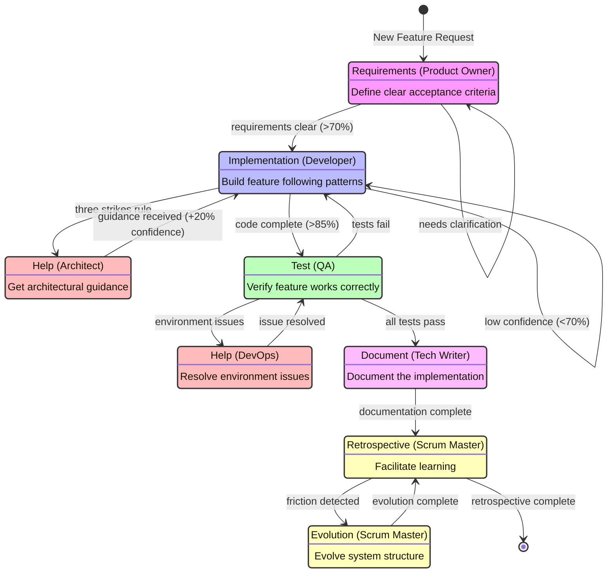
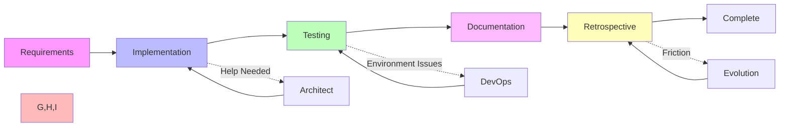

# Development State Machine

## Content Standards (v1.0 - Created 2025-01-26)
1. **State definitions must map to actual processes** - No theoretical states
2. **Transitions must have clear criteria** - When do we move between states
3. **Learning mechanisms must be explicit** - How the machine evolves
4. **All states must reference process docs** - Executable instructions
5. **Track success/failure rates** - Evidence-based improvement

*Standards Review: Does this state machine reflect our actual development process?*

---

## Overview

This document defines our development process as an executable state machine. Each state represents a phase:role combination, with clear transitions and learning mechanisms.

## Full State Diagram

## Simplified Process Flow

## State Execution

### Requirements (Product Owner)
- **Process Doc**: `/roles/product_owner/GOAL_DEFINE_REQUIREMENTS.md`
- **Entry**: User request exists
- **Exit**: Acceptance criteria defined
- **Transitions**:
  - → Implementation when requirements clear (>70% confidence)
  - → Requirements when needs clarification

### Implementation (Developer)
- **Process Doc**: `/roles/developer/GOAL_PROVE_CODE_WORKS.md`
- **Patterns**: Three-layer, Quality-first development
- **Entry**: Requirements clear
- **Exit**: Code complete, unit tests pass
- **Transitions**:
  - → Test when code complete (>85% confidence)
  - → Help (Architect) when three strikes rule triggered
  - → Implementation when low confidence (<70%)

### Test (QA)
- **Process Doc**: `/roles/qa/GOAL_PROVE_CODE_WONT_BREAK.md`
- **Patterns**: Test harness pattern
- **Entry**: Code complete
- **Exit**: All tests pass
- **Transitions**:
  - → Document when tests pass
  - → Implementation when tests fail
  - → Help (DevOps) when environment issues

### Document (Technical Writer)
- **Process Doc**: `/roles/technical_writer/GOAL_DOCUMENT_FEATURE.md`
- **Entry**: Feature working
- **Exit**: Documentation complete
- **Transitions**:
  - → Retrospective when complete

### Retrospective (Scrum Master)
- **Process Doc**: `/roles/scrum_master/GOAL_CAPTURE_LEARNING.md`
- **Entry**: Cycle complete
- **Exit**: Learnings captured
- **Transitions**:
  - → Evolution when friction detected
  - → Complete when done

## Global Rules

### Three Strikes Rule
- After 3 failed attempts, transition to help state
- Applies to all execution states
- Prevents spinning wheels

### Confidence Threshold
- Below 70% confidence requires help or more learning
- Above 85% confidence allows progression
- Confidence updates after each cycle

### Time Boxing
- Spending >3x estimated time triggers help
- Prevents endless debugging
- Forces asking for help

## Learning Mechanisms

### After Each State
- Update confidence levels
- Document patterns that worked/failed
- Track actual vs estimated time

### During Retrospectives
- Update all role confidence levels
- Capture new patterns
- Identify structural improvements

### Structural Evolution
- Add new states when needed
- Modify transitions based on experience
- Update process documents

## How to Use This State Machine

1. **Start Session**: Identify current state from project tracker
2. **Load Process**: Read the process doc for current state
3. **Execute**: Follow the process until exit criteria met
4. **Check Transitions**: Evaluate which transition to take
5. **Update State**: Record new state in project tracker
6. **Learn**: Update confidence and patterns based on results

This creates a deterministic, learning system that improves with each cycle.