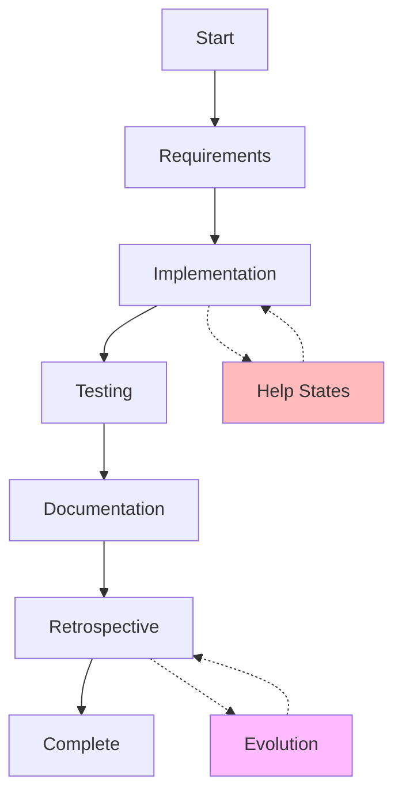

# Development State Machine - Program Entry Point

## Quick Start

**To build a Liquibase extension using this system:**

1. **Start Here** - This is your program entry point
2. **Load Current State** - Check PROJECT_STATE.md 
3. **Execute Current Phase** - Follow the state machine
4. **Learn and Improve** - System gets better each cycle

## What Is This?

This is a **turn-based development process** implemented as an executable state machine. Think of it as:
- A **program** that builds software
- A **game** where you play different roles
- A **learning system** that improves itself

## System Components

### 📋 Core Files

1. **development_machine.yaml** - The "source code" of our process
   - Defines all states (phase:role combinations)
   - Specifies transitions and rules
   - Contains learning mechanisms

2. **DEVELOPMENT_STATE_MACHINE.md** - Visual representation
   - Mermaid diagrams of the state flow
   - Human-readable documentation
   - Quick reference for the system

3. **PROJECT_STATE.md** - Current execution state
   - Where we are right now
   - History of state transitions
   - Predictions and analytics

### 🚀 Execution

4. **state_machine_executor.py** - Makes it run
   - Loads and executes state transitions
   - Enforces rules (confidence, three-strikes)
   - Generates automatic updates

### 📊 Analytics

5. **STATE_MACHINE_ANALYTICS.md** - Learning insights
   - Pattern analysis from history
   - Optimal path calculations
   - Evolution recommendations

6. **generate_state_diagram.py** - Visualization tool
   - Generates Mermaid from YAML
   - Updates documentation

## How to Use This System

### Session Start Sequence

```bash
# 1. Enter the state machine directory
cd /path/to/liquibase/claude_guide/state_machine

# 2. Check current state
cat PROJECT_STATE.md | head -20

# 3. Load the appropriate process
# If current_state: implementation_developer
# Then load: /roles/developer/GOAL_PROVE_CODE_WORKS.md

# 4. Execute until exit criteria met
# Then transition to next state
```

### Mental Model

```
while not project_complete:
    current = load_state()
    process = load_process(current.state)
    result = execute(process)
    
    if meets_exit_criteria(result):
        next_state = determine_transition(current, result)
        transition_to(next_state)
    else:
        handle_issues(current, result)
    
    learn_from_cycle(current, result)
```

## State Machine Overview



## Key Concepts

### States = Phase + Role
- `requirements_product_owner`
- `implementation_developer`
- `test_qa`

### Transitions = Rules
- Confidence thresholds (>70% to proceed)
- Quality gates (tests must pass)
- Global rules (three-strikes → help)

### Learning = Evolution
- Every cycle updates confidence
- Patterns emerge from repetition
- Structure evolves based on friction

## Example Execution

```yaml
# Current state
current_state: implementation_developer
confidence: 75%
attempts: 2

# Available transitions
- to: test_qa
  requires: code_complete AND confidence > 85%
- to: help_architect  
  triggers: three_strikes OR confidence < 70%
- to: implementation_developer
  when: need_more_work

# Action: Since confidence is 75%, continue implementation
# Goal: Reach 85% confidence or complete code
```

## Benefits of This System

1. **Deterministic** - Always know where you are
2. **Learning** - Gets better every cycle
3. **Predictive** - Estimates completion accurately
4. **Self-Improving** - Evolves its own structure
5. **Documented** - Every decision is recorded

## Next Steps

1. **Check Current State**: Read PROJECT_STATE.md
2. **Understand the Flow**: Review DEVELOPMENT_STATE_MACHINE.md
3. **Execute Current Phase**: Follow process for your current state
4. **Track Progress**: Update state on transitions
5. **Learn**: Let the system evolve

This is your **executable development process**. Each session continues from where the last one ended, building knowledge and improving efficiency.