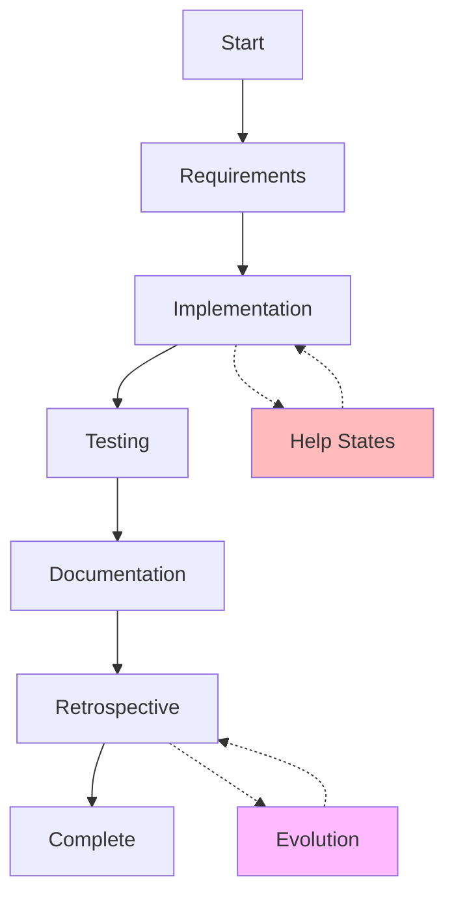

# Development State Machine - Program Entry Point

## Quick Start

**To build a Liquibase extension using this system:**

1. **Start Here** - This is your program entry point
2. **Load Current State** - Check core/PROJECT_STATE.md 
3. **Execute Current Phase** - Follow the state machine
4. **Learn and Improve** - System gets better each cycle

## Folder Structure

```
state_machine/
├── README.md                      # You are here
├── core/                          # Essential state machine files
│   ├── development_machine.yaml   # The state machine definition
│   ├── PROJECT_STATE.md          # Current state and history
│   └── SESSION_INIT.md           # How to start a session
│
├── accountability/                # Trust and compliance system
│   ├── ACCOUNTABILITY_SYSTEM.md  # How accountability works
│   ├── CONSENT_PROTOCOL.md       # Rules for getting permission
│   └── logs/                     # Action audit trail
│       └── ACTION_LOG.md         # Log of all actions taken
│
├── docs/                         # Documentation and visualizations
│   ├── DEVELOPMENT_STATE_MACHINE.md  # Visual diagrams
│   └── STATE_MACHINE_ANALYTICS.md    # Learning insights
│
├── tools/                        # Executable scripts
│   ├── state_machine_executor.py # Run the state machine
│   └── generate_state_diagram.py # Generate visualizations
│
└── archive/                      # Historical versions
    ├── development_machine_v1.yaml   # Original version
    └── CONSENT_PROTOCOL_EXAMPLES.md  # Example interactions
```

## What Is This?

This is a **turn-based development process** implemented as an executable state machine with built-in accountability. Think of it as:
- A **program** that builds software deterministically
- A **trust system** that ensures reliable behavior
- A **learning system** that improves itself

## How to Use This System

### Session Start Sequence

```bash
# 1. Enter the state machine directory
cd /path/to/liquibase/claude_guide/state_machine

# 2. Check current state
cat core/PROJECT_STATE.md | head -20

# 3. Review accountability rules for current state
grep -A 10 "current_state_name:" core/development_machine.yaml

# 4. Check action log for compliance
tail -20 accountability/logs/ACTION_LOG.md

# 5. Load the appropriate process
# If current_state: implementation_developer
# Then load: /roles/developer/GOAL_PROVE_CODE_WORKS.md

# 6. Execute until exit criteria met
# Then transition to next state
```

### Mental Model

```
while not project_complete:
    current = load_state()
    process = load_process(current.state)
    result = execute(process)
    
    if meets_exit_criteria(result):
        next_state = determine_transition(current, result)
        transition_to(next_state)
    else:
        handle_issues(current, result)
    
    learn_from_cycle(current, result)
```

## Accountability System

The state machine includes a comprehensive accountability system to ensure deterministic, trustworthy behavior:

### Key Features
- **State-Based Permissions**: Each state defines what actions are allowed, forbidden, or require consent
- **Action Logging**: Every action is logged with timestamp, permission status, and result
- **Consent Protocol**: File changes require explicit user consent before execution
- **Trust Tracking**: Trust score increases with good behavior, decreases with violations
- **Git Integration**: All changes are committed for full traceability and recovery

### Before Any Session
1. Check `accountability/logs/ACTION_LOG.md` for recent activity
2. Review `accountability/CONSENT_PROTOCOL.md` for the rules
3. Verify current trust level and any restrictions

## State Machine Overview



## Key Concepts

### States = Phase + Role
- `requirements_product_owner`
- `implementation_developer`
- `test_qa`

### Transitions = Rules
- Confidence thresholds (>70% to proceed)
- Quality gates (tests must pass)
- Global rules (three-strikes → help)

### Learning = Evolution
- Every cycle updates confidence
- Patterns emerge from repetition
- Structure evolves based on friction

## Example Execution

```yaml
# Current state
current_state: implementation_developer
confidence: 75%
attempts: 2

# Available transitions
- to: test_qa
  requires: code_complete AND confidence > 85%
- to: help_architect  
  triggers: three_strikes OR confidence < 70%
- to: implementation_developer
  when: need_more_work

# Action: Since confidence is 75%, continue implementation
# Goal: Reach 85% confidence or complete code
```

## Benefits of This System

1. **Deterministic** - Always know where you are
2. **Learning** - Gets better every cycle
3. **Predictive** - Estimates completion accurately
4. **Self-Improving** - Evolves its own structure
5. **Documented** - Every decision is recorded

## Next Steps

1. **Check Current State**: Read PROJECT_STATE.md
2. **Understand the Flow**: Review DEVELOPMENT_STATE_MACHINE.md
3. **Execute Current Phase**: Follow process for your current state
4. **Track Progress**: Update state on transitions
5. **Learn**: Let the system evolve

This is your **executable development process**. Each session continues from where the last one ended, building knowledge and improving efficiency.