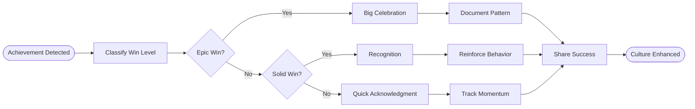

# Celebration Protocol Process

## Process Metadata
- **Version**: 1.0
- **Status**: active
- **Scope**: global (all achievements)
- **Owner**: scrum_master
- **Last Updated**: 2025-01-26
- **Validated Through**: To be validated (starting at 50% confidence)

## Purpose
Builds success culture by recognizing and celebrating wins at all levels. Creates positive reinforcement loop that accelerates learning and maintains motivation.

## Process Diagram


## Victory Conditions

### 🏆 EPIC WIN (Rare ~5%)
**Triggers**:
- [ ] Entire feature completed under estimate
- [ ] Zero rework needed on complex task
- [ ] New pattern discovered that saves others time
- [ ] Breakthrough solution to hard problem
- [ ] Excellence recognized by others

### 🎉 SOLID WIN (Common ~25%)
**Triggers**:
- [ ] Task completed successfully first try
- [ ] Time estimate accurate (±10%)
- [ ] No help needed on moderate task
- [ ] Clean code with good tests
- [ ] Helped someone else succeed

### ✨ SMALL WIN (Daily ~70%)
**Triggers**:
- [ ] Made progress without getting stuck
- [ ] Learned something new
- [ ] Improved efficiency
- [ ] Fixed a bug quickly
- [ ] Good daily momentum

## Process Steps

### Step 1: Detect Achievement
- **Actor**: anyone (self-report encouraged)
- **Time**: Real-time
- **Action**: Recognize win occurred
- **Methods**:
  - Automatic detection (time/quality)
  - Self-reporting
  - Peer recognition
  - Metric triggers
- **Output**: Achievement identified

### Step 2: Classify Win Level
- **Actor**: system or person
- **Time**: < 1 minute
- **Action**: Determine win category
- **Criteria**: Check triggers above
- **Output**: Win level (Epic/Solid/Small)

### Step 3A: Epic Win Celebration
- **Actor**: whole team
- **Time**: 15-30 minutes
- **Action**: Big recognition + learning capture
- **Activities**:
  ```markdown
  ## EPIC WIN DETECTED! 🏆
  **Achievement**: [What was accomplished]
  **Hero**: [Who did it]
  **Impact**: [Time saved, quality improved, etc.]
  
  ### Celebration Activities:
  1. 🎊 Add to Victory Wall of Fame
  2. 🏅 Award special badge/recognition
  3. 📈 Major confidence boost (+25%)
  4. 📝 Document pattern in detail
  5. 🚀 Share story with wider team
  6. 🎯 Set next stretch goal
  7. 🍰 Team celebration (virtual/real)
  ```
- **Output**: Major morale boost + pattern

### Step 3B: Solid Win Recognition  
- **Actor**: team lead/peers
- **Time**: 5-10 minutes
- **Action**: Meaningful recognition
- **Activities**:
  ```markdown
  ## Solid Win! 🎉
  **Achievement**: [What succeeded]
  **By**: [Who achieved it]
  **Notable**: [Why it matters]
  
  Recognition:
  - Public kudos in team channel
  - Confidence boost (+10-15%)
  - Pattern reinforcement
  - Add to weekly wins
  ```
- **Output**: Recognition + reinforcement

### Step 3C: Small Win Acknowledgment
- **Actor**: self or peer
- **Time**: < 2 minutes
- **Action**: Quick positive note
- **Format**: "✨ Nice! [what went well]"
- **Tracking**: Add to momentum score
- **Output**: Positive momentum

### Step 4: Document Learning
- **Actor**: achiever + technical_writer
- **Time**: 5-15 minutes (proportional to win)
- **Action**: Capture reusable knowledge
- **For Epic Wins**: Full pattern documentation
- **For Solid Wins**: Add to tips/tricks
- **For Small Wins**: Note in daily log
- **Output**: Captured knowledge

### Step 5: Share Success
- **Actor**: scrum_master
- **Time**: Varies
- **Action**: Spread the good news
- **Channels**:
  - Team dashboard
  - Weekly retrospective
  - Pattern library
  - Success stories collection
- **Output**: Team inspiration

## Celebration Examples

### Epic Win Example
```markdown
## EPIC WIN DETECTED! 🏆
**Achievement**: Warehouse feature complete with all tests
**Hero**: Developer role
**Time**: 2.5 hours (estimated 5 hours!) 
**Quality**: 100% test coverage, elegant solution
**Innovation**: Discovered reusable WITH clause builder

### Impact Analysis:
- 50% time reduction
- Pattern will save 30+ min per similar task
- Zero defects in implementation
- Can be applied to 5+ other features

### Celebration Executed:
✅ Added to Victory Wall
✅ "Pattern Pioneer" badge awarded
✅ Confidence: SQL Generation 75% → 95%
✅ Pattern documented and shared
✅ Team pizza party scheduled
✅ Next goal: Apply pattern to Database object
```

### Solid Win Example
```markdown
## Solid Win! 🎉
**Achievement**: CreateSchema tests all passing
**By**: QA role
**Notable**: Found and fixed edge case proactively

Recognition given:
- Team channel: "@qa Great catch on the edge case!"
- Confidence: Testing 80% → 88%
- Added to "QA Saves the Day" tally
```

## Anti-Patterns to Avoid

### Celebration Inflation
- Don't celebrate mediocrity
- Don't force celebrations
- Don't make them meaningless

### Celebration Neglect
- Don't skip because "too busy"
- Don't downplay achievements
- Don't forget team wins

## Metrics
- **Initial Confidence**: 50% (needs validation)
- **Success Metric**: Team morale scores
- **Value Metric**: Increased win frequency

## Related Documents
- Processes: SUCCESS_AMPLIFIER_PROCESS
- Culture: Team morale tracking
- Patterns: Victory pattern library

## Learning History
| Date | Learning | Impact |
|------|----------|--------|
| 2025-01-26 | Process created from LBCF | To be validated |

## Change Log
| Version | Date | Change | Reason |
|---------|------|--------|--------|
| 1.0 | 2025-01-26 | Initial version | Build success culture |