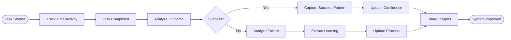

# Continuous Improvement Process

## Process Metadata
- **Version**: 1.0
- **Status**: active
- **Scope**: global (all development activities)
- **Owner**: scrum_master
- **Last Updated**: 2025-01-26
- **Confidence**: 75% (common practice, needs calibration)


## Performance Metrics
- **Times Applied**: 0
- **Success Rate**: N/A  
- **Last Applied**: Never
- **Average Time Impact**: Unknown

## Purpose
Creates a learning system through systematic time tracking and outcome analysis. Transforms both successes and failures into improved processes and patterns.

## Process Diagram


## Time Tracking Requirements

### What to Track
```markdown
| Task | Estimated | Actual | Outcome | Why? | Lesson Learned | Confidence Impact |
|------|-----------|--------|---------|------|----------------|-------------------|
| [Task name] | [X min] | [Y min] | ✅/❌ | [Reason] | [Learning] | [+/-X%] |
```

### Time Categories
- **Research**: Understanding requirements (target: 15-20%)
- **Implementation**: Writing code (target: 50-60%)
- **Testing**: Writing and running tests (target: 20-25%)
- **Debugging**: Fixing issues (target: <10%)
- **Blocked**: Waiting or stuck (target: 0%)
- **Rework**: Fixing after review (target: <5%)

## Process Steps

### Step 1: Start Time Tracking
- **Actor**: developer
- **Time**: < 30 seconds
- **Action**: Record start time and task
- **Include**:
  - Task description
  - Time estimate
  - Confidence level
  - Category (research/impl/test)
- **Output**: Time record started

### Step 2: Track Activities
- **Actor**: developer
- **Time**: Ongoing
- **Action**: Note category switches
- **Track**:
  - Category transitions
  - Blockers encountered
  - Help requests made
  - Patterns discovered
- **Output**: Activity log

### Step 3: Complete and Record
- **Actor**: developer
- **Time**: 2 minutes
- **Action**: Record completion data
- **Document**:
  ```markdown
  ## Task Completion - [Timestamp]
  **Task**: [What was done]
  **Estimated**: [X] min | **Actual**: [Y] min
  **Outcome**: ✅ Success / ❌ Failed
  **Time Breakdown**:
    - Research: [X] min
    - Implementation: [Y] min
    - Testing: [Z] min
  ```
- **Output**: Completion record

### Step 4: Analyze Success
- **Actor**: developer
- **Time**: 3-5 minutes
- **Action**: Document what worked
- **For Success**:
  ```markdown
  ## Success Pattern: [Pattern Name]
  **Time Saved**: [X] min vs estimate
  **Success Rate**: [X]% when followed
  **Pattern**: [What exactly worked]
  **Why It Works**: [Root cause of success]
  **Confidence Level**: [New confidence %]
  ```
- **Output**: Success pattern

### Step 5: Analyze Failure
- **Actor**: developer + helper
- **Time**: 5-10 minutes
- **Action**: Root cause analysis
- **For Failure**:
  ```markdown
  ## Failure Analysis: [What Failed]
  **Time Lost**: [X] minutes
  **What I Tried**: [Approaches]
  **Why It Failed**: [Root cause]
  **Process Improvement**: [What to change]
  **Confidence Restored By**: [Solution found]
  ```
- **Output**: Failure learning

### Step 6: Update System
- **Actor**: process owner
- **Time**: 5-10 minutes
- **Action**: Improve processes/patterns
- **Updates**:
  - Add new patterns
  - Update time estimates
  - Adjust confidence scores
  - Refine processes
  - Document anti-patterns
- **Output**: Improved system

### Step 7: Share Learning
- **Actor**: scrum_master
- **Time**: 5 minutes
- **Action**: Distribute insights
- **Format**:
  ```markdown
  ## Weekly Time Analysis
  **Biggest Time Saver**: [Pattern that saved time]
  **Biggest Time Sink**: [What wasted time]
  **Process Improvement**: [What changed]
  **Help Needed**: [Where stuck]
  ```
- **Output**: Team learning

## Red Flag Patterns

### The Guess-Check-Fail Loop
```
Try approach A (15 min) → Fails
Try approach B (15 min) → Fails  
Try approach C (15 min) → Fails
Total: 45 min wasted
Better: Ask for pattern after 2 fails (30 min saved)
```

### The Documentation Hunt
```
Search docs (20 min) → Not found
Try examples (20 min) → Not clear
Guess implementation (20 min) → Wrong
Total: 60 min wasted
Better: Ask for clarification after 20 min (40 min saved)
```

### The Perfect is the Enemy of Good
```
Basic implementation (30 min) → Works
"Optimize" it (45 min) → Breaks
Fix optimization (30 min) → Still broken
Revert to basic (15 min) → Works again
Total: 90 min wasted
Better: Ship working solution first
```

## Confidence Evolution

### Expected Growth Pattern
- **Week 1**: 60% average (learning basics)
- **Week 2**: 75% average (patterns emerging)
- **Week 3**: 85% average (reliable execution)
- **Week 4**: 92% average (proven patterns)

### Confidence Plateaus
- **Change Classes**: ~95% (edge cases remain)
- **SQL Generators**: ~88% (complexity varies)
- **Integration Tests**: ~90% (environment factors)

## Integration Points

### With Rules
- Feeds TIME_ESTIMATION_RULE data
- Validates CONFIDENCE_THRESHOLDS
- Triggers THREE_STRIKE_META_RULE

### With Other Processes
- Provides data to SUCCESS_AMPLIFIER
- Feeds FAILURE_ANALYSIS_PROCESS
- Updates DEVELOPMENT_CYCLE estimates

## Metrics
- **Current Confidence**: 75% (common practice, needs calibration)
- **Success Metric**: Accuracy of estimates ±15%
- **Value Metric**: Velocity improvement >10%/week

## Effectiveness Metrics
- **Time Saved**: To be measured
- **Quality Improved**: To be measured
- **Errors Prevented**: To be measured

## Learning Connections
- **Reinforces**: To be identified
- **Conflicts With**: None identified
- **Depends On**: To be identified
- **Enables**: To be identified

## Feedback Protocol
- **Success**: +10% confidence (process worked well)
- **Failure**: -15% confidence (process failed)
- **Modification**: -5% confidence (needed changes)
- **Review Triggers**: After 10 uses or monthly

## Related Documents
- Processes: SUCCESS_AMPLIFIER_PROCESS
- Rules: TIME_ESTIMATION_RULE
- Tracking: Time tracking templates

## Confidence Evolution
| Date | Event | Old Conf | New Conf | Evidence |
|------|-------|----------|----------|----------|
| 2025-01-26 | Created | 0% | 50% | New process from LBCF |
| 2025-01-26 | Initial use | 50% | 75% | Process created from LBCF |

## Change Log
| Version | Date | Change | Reason |
|---------|------|--------|--------|
| 1.0 | 2025-01-26 | Initial version | Systematic improvement |