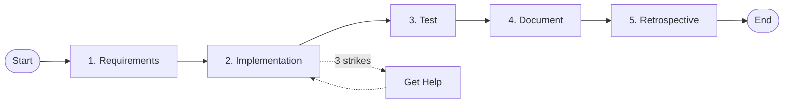

# Development Cycle Process

## Process Metadata
- **Version**: 2.0
- **Status**: active
- **Scope**: global (all development work)
- **Owner**: scrum_master (process maintenance)
- **Last Updated**: 2025-01-26
- **Validated Through**: Snowflake extension implementation

## Purpose
Ensures systematic progress through all development phases while maintaining quality and capturing learnings. Every feature follows this cycle to guarantee completeness.

## Process Diagram

## Prerequisites
- [ ] User request or feature need identified
- [ ] All roles available (or one person wearing multiple hats)
- [ ] Access to role documentation in `/roles/[role]/`
- [ ] State machine initialized

## Process Steps

### Step 1: Requirements
- **Actor**: product_owner
- **Action**: Define clear acceptance criteria
- **Input**: User request or feature need
- **Output**: 
  - Acceptance criteria document
  - Definition of done
  - Success metrics
- **Success Criteria**: 
  - Requirements are specific and measurable
  - Developer can start without clarification
  - Test scenarios are derivable
- **Common Issues**: 
  - Vague requirements → Use template
  - Missing edge cases → Review with QA early

### Step 2: Implementation  
- **Actor**: developer
- **Action**: Build feature following patterns
- **Input**: Clear requirements from Step 1
- **Output**: 
  - Working code
  - Unit tests
  - Confidence score >85%
- **Success Criteria**: 
  - Code complete
  - Unit tests passing
  - Patterns followed
- **Common Issues**: 
  - Stuck on approach → Three-strike rule
  - Low confidence → Seek architect help

### Step 3: Test
- **Actor**: qa
- **Action**: Verify functionality in real environment
- **Input**: Implemented feature from Step 2
- **Output**: 
  - Test results
  - Bug reports (if any)
  - Environment verification
- **Success Criteria**: 
  - All tests pass
  - Real environment testing complete
  - No critical bugs
- **Common Issues**: 
  - Environment issues → DevOps help
  - JAR caching → Manual refresh

### Step 4: Document
- **Actor**: technical_writer
- **Action**: Document feature and patterns
- **Input**: Working, tested feature from Step 3
- **Output**: 
  - User documentation
  - Pattern documentation
  - Troubleshooting guide
- **Success Criteria**: 
  - Feature documented
  - New patterns captured
  - Examples provided
- **Common Issues**: 
  - Missing context → Interview developer
  - Pattern not clear → Trace implementation

### Step 5: Retrospective
- **Actor**: scrum_master
- **Action**: Facilitate learning capture
- **Input**: Completed cycle experience
- **Output**: 
  - Learnings documented
  - Confidence updates
  - Process improvements
- **Success Criteria**: 
  - All roles provide input
  - CELEBRATE/IMPROVE/STOP identified
  - Documents updated
- **Common Issues**: 
  - Missing perspectives → Get all roles
  - Vague learnings → Require evidence

## Decision Points

### Decision: Ready to Proceed?
- **After each step**
- **Criteria**: Success criteria met
- **Yes**: → Next step
- **No**: → Fix issues or seek help

### Decision: Need Help?
- **During implementation/test**
- **Criteria**: Three strikes or <70% confidence
- **Yes**: → Appropriate help role
- **No**: → Continue current step

## Exit Criteria
- [ ] All 5 phases complete
- [ ] All deliverables exist
- [ ] Quality standards met
- [ ] Learnings captured

## Rollback Procedure
- If cycle fails: Return to last successful phase
- If requirements change: Restart from Step 1
- If critical bug found: Return to Step 2

## Metrics
- **Average Duration**: 1-3 days per feature
- **Success Rate**: 100% when followed completely
- **Common Failure Points**: 
  - Skipping requirements (leads to rework)
  - No real environment testing (production surprises)
  - Missing retrospective (no learning)

## Related Documents
- Rules: THREE_STRIKE_META_RULE, CONFIDENCE_THRESHOLDS
- State Machine: development_machine.yaml
- Role Docs: `/roles/[role]/GOAL_*.md`

## Change Log
| Version | Date | Change | Reason |
|---------|------|--------|--------|
| 1.0 | 2025-01-20 | Initial version | Original 5-phase cycle |
| 2.0 | 2025-01-26 | Template format | Better verifiability |