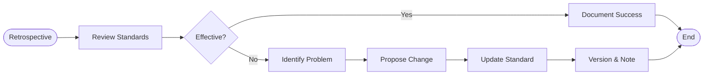

# Document Standards Evolution Process

## Process Metadata
- **Version**: 2.0
- **Status**: active
- **Scope**: global (all document types)
- **Owner**: scrum_master (process improvement)
- **Last Updated**: 2025-01-26
- **Validated Through**: Successfully updated role context standards

## Purpose
Ensures document standards remain effective and evolve based on actual usage. Prevents standards from becoming outdated or ignored by making them living documents that improve through retrospectives.

## Process Diagram


## Prerequisites
- [ ] Retrospective in progress
- [ ] Documents using standards available for review
- [ ] Evidence of standard effectiveness/problems
- [ ] Scrum master facilitating

## Process Steps

### Step 1: Review Standards Effectiveness
- **Actor**: scrum_master
- **Action**: Ask "Are our document standards working?"
- **Input**: Current standards and documents
- **Output**: 
  - List of effective standards
  - List of problematic standards
  - Evidence for each assessment
- **Success Criteria**: 
  - All active standards reviewed
  - Evidence-based assessment
  - Team consensus reached
- **Common Issues**: 
  - No evidence → Check actual documents
  - Vague feedback → Request specifics

### Step 2: Identify Problems or Successes
- **Actor**: all roles
- **Action**: Provide specific examples
- **Input**: Experience using standards
- **Output**: 
  - Standards that prevented problems
  - Standards that were ignored
  - Missing standards that would help
- **Success Criteria**: 
  - Specific examples provided
  - Root causes identified
  - Improvements possible
- **Common Issues**: 
  - Generic complaints → Dig deeper
  - No examples → Review recent work

### Step 3: Propose Changes
- **Actor**: any role
- **Action**: Suggest specific improvements
- **Input**: Identified problems
- **Output**: 
  - Proposed standard changes
  - Rationale for each change
  - Expected impact
- **Success Criteria**: 
  - Changes are specific
  - Rationale is clear
  - Team agrees
- **Common Issues**: 
  - Too many changes → Prioritize
  - Vague proposals → Make specific

### Step 4: Update Standards
- **Actor**: technical_writer or scrum_master
- **Action**: Modify standard documents
- **Input**: Approved changes
- **Output**: 
  - Updated standards
  - Version number incremented
  - Change note added
- **Success Criteria**: 
  - Standards updated
  - Version tracked
  - Changes documented
- **Common Issues**: 
  - Forgot version → Add it
  - No change note → Explain why

### Step 5: Document Learning
- **Actor**: scrum_master
- **Action**: Record what we learned
- **Input**: Standard evolution
- **Output**: 
  - Learning log entry
  - Effectiveness metrics
  - Next review date
- **Success Criteria**: 
  - Learning captured
  - Metrics updated
  - Schedule set
- **Common Issues**: 
  - Vague learning → Be specific
  - No metrics → Define them

## Decision Points

### Decision: Is Standard Effective?
- **Criteria**: Evidence of helping vs hindering
- **Effective**: → Document success
- **Ineffective**: → Identify problem
- **Unknown**: → Gather more data

## Exit Criteria
- [ ] All standards reviewed
- [ ] Necessary updates made
- [ ] Version numbers updated
- [ ] Team informed of changes

## Rollback Procedure
If new standard causes problems:
1. Revert to previous version
2. Document why it failed
3. Try different approach

## Metrics
- **Review Frequency**: Every retrospective
- **Standards Updated**: ~20% per review
- **Effectiveness Rate**: 85% helpful

## Standard Types and Focus

### Role Context Documents
- **Current Standards**: v1.0
  - Only validated learnings
  - Evidence required
  - Confidence from attempts
- **Review Focus**: Are we capturing right learnings?

### Pattern Documents
- **Current Standards**: TBD
  - Success/failure rates required
  - Prerequisites clear
  - Real examples only
- **Review Focus**: Do patterns help implementation?

### Process Documents  
- **Current Standards**: v2.0 (using templates)
  - Complete specification
  - Verifiable steps
  - Clear ownership
- **Review Focus**: Are processes followable?

## Version Format Example
```markdown
## Content Standards (v1.1 - Updated 2025-MM-DD)
1. Previous standard still applies
2. Previous standard modified: [change]
3. NEW: Additional standard because [reason]

*Change note: Added standard #3 after finding [specific problem]*
*Standards Review: 2025-MM-DD - Found effective except [issue]*
```

## Related Documents
- Rules: All rules have embedded standards
- Templates: PROCESS_TEMPLATE, RULE_TEMPLATE
- All Documents: Every doc has standards header

## Change Log
| Version | Date | Change | Reason |
|---------|------|--------|--------|
| 1.0 | 2025-01-26 | Initial version | Need evolution process |
| 2.0 | 2025-01-26 | Template format | Better completeness |