# Failure Analysis Process

## Process Metadata
- **Version**: 1.0
- **Status**: active
- **Scope**: global (all failures and mistakes)
- **Owner**: person who experienced failure
- **Last Updated**: 2025-01-26
- **Validated Through**: To be validated (starting at 50% confidence)

## Purpose
Transform failures into learning opportunities through systematic analysis. Every failure contains valuable information about wrong assumptions, missing knowledge, or process gaps.

## Process Diagram

```mermaid
graph LR
    Start([Failure Detected]) --> Stop[Stop Current Approach]
    Stop --> Document[Document What Happened]
    Document --> Analyze[Root Cause Analysis]
    Analyze --> Learn[Extract Learning]
    Learn --> Update[Update Process/Rules]
    Update --> Share[Share with Team]
    Share --> Prevent[Prevent Recurrence]
    Prevent --> End([Improved System])
```


## Failure Triggers
- [ ] Approach failed after multiple attempts
- [ ] Time significantly exceeded estimate
- [ ] Wrong output despite following process
- [ ] Unexpected errors or behavior
- [ ] Had to completely restart
- [ ] Required emergency help
- [ ] Violated rules/process

## Process Steps

### Step 1: Stop and Acknowledge
- **Actor**: person who failed
- **Time**: 1 minute
- **Action**: Accept failure, stop current approach
- **Mindset**: "This is learning, not defeat"
- **Output**: Ready for analysis

### Step 2: Document Failure Details
- **Actor**: same person
- **Time**: 5-10 minutes
- **Action**: Capture while fresh
- **Document**:
  ```markdown
  ## Failure Analysis: [What Failed]
  Time Lost: [Actual time spent]
  Attempts: [Number of tries]
  
  What I Tried:
  1. [First approach] → [Why it failed]
  2. [Second approach] → [Why it failed]
  3. [Third approach] → [Why it failed]
  
  Expected Outcome: [What should have happened]
  Actual Outcome: [What actually happened]
  ```
- **Output**: Failure record

### Step 3: Root Cause Analysis
- **Actor**: person + helper if needed
- **Time**: 15 minutes
- **Action**: Dig beneath symptoms
- **Questions**:
  - What assumption was wrong?
  - What information was missing?
  - What pattern didn't apply?
  - Where did process break down?
- **Techniques**:
  - 5 Whys
  - Assumption validation
  - Process trace
- **Output**: True root cause

### Step 4: Extract Learning
- **Actor**: same person
- **Time**: 10 minutes
- **Action**: Convert failure to knowledge
- **Format**:
  ```markdown
  ## Learning from Failure
  
  Root Cause: [The real problem]
  
  What I Learned:
  - [Specific learning 1]
  - [Specific learning 2]
  
  Process Improvement:
  - [What to do differently]
  - [New check to add]
  
  Knowledge Gap Filled:
  - [What I now know]
  ```
- **Output**: Actionable learning

### Step 5: Update Process/Rules
- **Actor**: process owner
- **Time**: 15 minutes
- **Action**: Prevent recurrence
- **Updates**:
  - Add new validation step
  - Update rule with exception
  - Create new pattern
  - Add to anti-patterns
  - Update documentation
- **Output**: Improved system

### Step 6: Share Learning
- **Actor**: team/scrum master
- **Time**: 5 minutes
- **Action**: Spread knowledge
- **Channels**:
  - Team chat/dashboard
  - Retrospective item
  - Pattern library
  - Anti-pattern docs
- **Output**: Team awareness

## Root Cause Categories

### Knowledge Gaps
- Missing information
- Wrong documentation
- Undocumented behavior
- Version differences

### Process Failures
- Skipped steps
- Wrong order
- Missing validation
- Unclear requirements

### Assumption Errors
- Invalid assumptions
- Unverified beliefs
- Context differences
- Edge cases missed

### Environmental Issues
- Configuration problems
- Version mismatches
- Permission issues
- Resource constraints

## Example Failure Analyses

### Example 1: Implementation Failure
```markdown
## Failure Analysis: Immutable Statement Pattern
Time Lost: 45 minutes
Attempts: 3

What I Tried:
1. Final fields with constructor → Liquibase couldn't instantiate
2. Builder pattern → Service loader failed
3. Defensive copies → Still failed

Root Cause: Liquibase requires JavaBean pattern (mutable)

Learning:
- Liquibase uses reflection expecting setters
- Framework constraints override clean code preferences
- Always check framework requirements first

Process Improvement:
- Add "Check framework constraints" to implementation checklist
- Document this in pattern library
```

### Example 2: Testing Failure
```markdown
## Failure Analysis: Integration Tests Keep Failing
Time Lost: 2 hours
Attempts: 5+

What I Tried:
1. Fix SQL syntax → Still failed
2. Update expected files → Still failed
3. Check database state → Looked correct
4. Rewrite test → Still failed
5. Clean rebuild → Still failed

Root Cause: JAR file cached in test harness

Learning:
- Test harness doesn't auto-reload JARs
- Build success doesn't mean deployment success
- Environment verification crucial

Process Improvement:
- Add JAR timestamp check to test process
- Create deployment verification step
```

## Failure Metrics

### Track for Improvement
- Time lost to failures
- Root cause categories
- Process improvements made
- Recurrence rate

### Failure Patterns
- Most common root causes
- Expensive failure types
- Repeat failure areas
- Process gap indicators

## Integration Points

### With Rules
- Update THREE_STRIKE_RULE triggers
- Add new validation rules
- Refine confidence thresholds

### With Retrospectives
- Major failures discussed
- Systemic issues identified
- Process improvements planned

## Metrics
- **Initial Confidence**: 50% (needs validation)
- **Success Metric**: Reduced repeat failures
- **Learning Metric**: Root causes identified

## Related Documents
- Processes: SUCCESS_CAPTURE_PROCESS (opposite)
- Rules: THREE_STRIKE_RULE (when to stop)
- Anti-patterns: Library of what doesn't work

## Learning History
| Date | Learning | Impact |
|------|----------|--------|
| 2025-01-26 | Process created from LBCF | To be validated |

## Change Log
| Version | Date | Change | Reason |
|---------|------|--------|--------|
| 1.0 | 2025-01-26 | Initial version | Systematic failure learning |