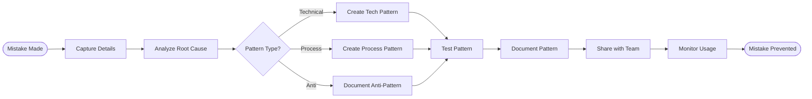

# Mistake to Pattern Process

## Process Metadata
- **Version**: 1.0
- **Status**: active
- **Scope**: global (all mistakes and failures)
- **Owner**: technical_writer + developer
- **Last Updated**: 2025-01-26
- **Confidence**: 60% (good concept, needs validation)


## Performance Metrics
- **Times Applied**: 0
- **Success Rate**: N/A  
- **Last Applied**: Never
- **Average Time Impact**: Unknown

## Purpose
Transforms every mistake into a documented pattern or anti-pattern, ensuring the same mistake is never repeated. Creates organizational learning from individual errors.

## Process Diagram


## Trigger Conditions
- [ ] Same mistake made twice
- [ ] Costly mistake (>30 min lost)
- [ ] Mistake affects others
- [ ] Systematic issue discovered
- [ ] Wrong assumption exposed

## Process Steps

### Step 1: Capture Mistake Details
- **Actor**: person who made mistake
- **Time**: 5 minutes (while fresh)
- **Action**: Document what happened
- **Template**:
  ```markdown
  ## Mistake Capture - [Timestamp]
  **What I Was Trying**: [Goal/task]
  **What I Did**: [Specific actions]
  **What Went Wrong**: [Failure description]
  **Time Lost**: [X] minutes
  **Impact**: [Who/what affected]
  ```
- **Output**: Mistake record

### Step 2: Root Cause Analysis
- **Actor**: developer + helper
- **Time**: 10-15 minutes
- **Action**: Find true cause
- **Questions**:
  - What assumption was wrong?
  - What information was missing?
  - What pattern was misunderstood?
  - What wasn't checked?
- **Output**: Root cause identified

### Step 3: Categorize Pattern Type
- **Actor**: architect
- **Time**: 2 minutes
- **Action**: Determine pattern category
- **Categories**:
  - **Technical**: Code/API patterns
  - **Process**: Workflow patterns
  - **Anti-Pattern**: What not to do
- **Output**: Pattern type

### Step 4A: Create Technical Pattern
- **Actor**: developer
- **Time**: 15-20 minutes
- **Action**: Document working solution
- **Format**:
  ```markdown
  ## Technical Pattern: [Name]
  **Problem**: [What doesn't work]
  **Solution**: [What does work]
  **Code Example**:
  ```java
  // WRONG way that caused mistake
  [bad code]
  
  // RIGHT way that works
  [good code]
  ```
  **Why This Works**: [Technical explanation]
  **When to Use**: [Specific scenarios]
  ```
- **Output**: Technical pattern

### Step 4B: Create Process Pattern
- **Actor**: scrum_master
- **Time**: 10-15 minutes
- **Action**: Document process improvement
- **Format**:
  ```markdown
  ## Process Pattern: [Name]
  **Problem**: [Process that failed]
  **Solution**: [Better process]
  **Steps**:
  1. [New step 1]
  2. [New step 2]
  **Prevents**: [What mistakes]
  **Time Saved**: [Estimate]
  ```
- **Output**: Process pattern

### Step 4C: Document Anti-Pattern
- **Actor**: technical_writer
- **Time**: 10 minutes
- **Action**: Document what not to do
- **Format**:
  ```markdown
  ## Anti-Pattern: [Name]
  ⚠️ **DON'T DO THIS** ⚠️
  **What Not to Do**: [Bad approach]
  **Why It Fails**: [Explanation]
  **What Happens**: [Consequences]
  **Do This Instead**: [Right approach]
  **Real Example**: [Actual failure]
  ```
- **Output**: Anti-pattern doc

### Step 5: Test Pattern
- **Actor**: qa
- **Time**: 15-30 minutes
- **Action**: Verify pattern works
- **Testing**:
  - Apply to original scenario
  - Try in similar scenario
  - Check edge cases
  - Verify time savings
- **Output**: Validated pattern

### Step 6: Document and Index
- **Actor**: technical_writer
- **Time**: 10 minutes
- **Action**: Add to pattern library
- **Location**: `/patterns/[category]/`
- **Index Update**: Add to searchable index
- **Tags**: Add relevant keywords
- **Output**: Accessible pattern

### Step 7: Share with Team
- **Actor**: scrum_master
- **Time**: 5 minutes
- **Action**: Announce new pattern
- **Channels**:
  - Team chat/dashboard
  - Pattern of the week
  - Update CLAUDE.md
  - Add to onboarding
- **Output**: Team awareness

### Step 8: Monitor Usage
- **Actor**: system
- **Time**: Ongoing
- **Action**: Track pattern success
- **Metrics**:
  - Times used
  - Success rate
  - Time saved
  - Mistakes prevented
- **Output**: Usage statistics

## Transformation Examples

### Example 1: Technical Mistake
```markdown
**Mistake**: Assumed all databases use IF NOT EXISTS
**Time Lost**: 30 min debugging PostgreSQL
**Root Cause**: Didn't check database capabilities

**Pattern Created**: Database Capability Check
```java
// Always check before using optional syntax
if (database.supportsCreateIfNotExists(Domain.class)) {
    sql.append("IF NOT EXISTS ");
}
```
**Result**: Never made this mistake again
```

### Example 2: Process Mistake
```markdown
**Mistake**: Didn't run tests before commit
**Impact**: Broke CI build, blocked team
**Root Cause**: Rushed to finish

**Pattern Created**: Pre-Commit Checklist
1. Run unit tests locally
2. Run integration tests  
3. Check CI status
4. Then commit

**Result**: Zero broken builds since
```

## Pattern Library Structure
```
patterns/
├── technical/
│   ├── sql-generation/
│   ├── validation/
│   └── testing/
├── process/
│   ├── development/
│   ├── debugging/
│   └── collaboration/
└── anti-patterns/
    ├── common-mistakes/
    ├── wrong-assumptions/
    └── bad-practices/
```

## Success Metrics

### Pattern Effectiveness
- Mistake never repeated: 100% success
- Time saved per use: Track actual
- Team adoption rate: >80% target
- Pattern improvements: Continuous

### Learning Velocity
- Week 1: 5-10 patterns created
- Week 2: 3-5 patterns (fewer mistakes)
- Week 3: 1-2 patterns (mostly edge cases)
- Week 4+: <1 pattern (system maturing)

## Integration Points

### With Rules
- Supports THREE_STRIKE_META_RULE
- Prevents ITERATION_WITHOUT_PROGRESS
- Updates confidence scoring

### With Other Processes
- Fed by FAILURE_ANALYSIS_PROCESS
- Opposite of SUCCESS_AMPLIFIER
- Improves DEVELOPMENT_CYCLE

## Metrics
- **Current Confidence**: 60% (good concept, needs validation)
- **Success Metric**: Mistakes not repeated
- **Value Metric**: Time saved by patterns

## Effectiveness Metrics
- **Time Saved**: To be measured
- **Quality Improved**: To be measured
- **Errors Prevented**: To be measured

## Learning Connections
- **Reinforces**: To be identified
- **Conflicts With**: None identified
- **Depends On**: To be identified
- **Enables**: To be identified

## Feedback Protocol
- **Success**: +10% confidence (process worked well)
- **Failure**: -15% confidence (process failed)
- **Modification**: -5% confidence (needed changes)
- **Review Triggers**: After 10 uses or monthly

## Related Documents
- Processes: FAILURE_ANALYSIS_PROCESS
- Library: Pattern library
- Anti-patterns: What not to do

## Confidence Evolution
| Date | Event | Old Conf | New Conf | Evidence |
|------|-------|----------|----------|----------|
| 2025-01-26 | Created | 0% | 50% | New process from LBCF |
| 2025-01-26 | Initial use | 50% | 60% | Process created from LBCF |

## Change Log
| Version | Date | Change | Reason |
|---------|------|--------|--------|
| 1.0 | 2025-01-26 | Initial version | Never repeat mistakes |