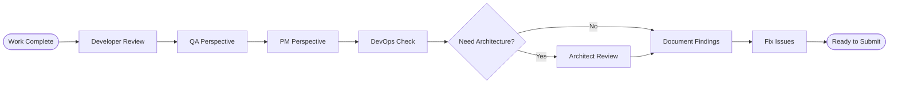

# Multi-Perspective Review Process

## Process Metadata
- **Version**: 1.0
- **Status**: active
- **Scope**: global (all implementation work)
- **Owner**: developer (initiates review)
- **Last Updated**: 2025-01-26
- **Confidence**: 65% (useful but needs streamlining)


## Performance Metrics
- **Times Applied**: 0
- **Success Rate**: N/A  
- **Last Applied**: Never
- **Average Time Impact**: Unknown

## Purpose
Systematically review completed work from multiple role perspectives to catch issues that a single viewpoint would miss. Each role focuses on different aspects, creating comprehensive quality coverage.

## Process Diagram


## Prerequisites
- [ ] Implementation functionally complete
- [ ] Basic developer testing done
- [ ] 15-30 minutes available for review
- [ ] Access to role checklists

## Process Steps

### Step 1: Developer Final Check
- **Actor**: developer
- **Time**: 5 minutes
- **Action**: Verify implementation completeness
- **Focus**: 
  - Code follows patterns
  - All requirements met
  - No obvious issues
- **Checklist**:
  - [ ] Pattern followed correctly?
  - [ ] All attributes implemented?
  - [ ] Code clean and readable?
  - [ ] TODOs addressed?
- **Output**: Ready for multi-perspective review

### Step 2: QA Perspective Review
- **Actor**: developer (wearing QA hat)
- **Time**: 10 minutes
- **Action**: Look for what could break
- **Focus**:
  - Edge cases
  - Error handling
  - Test coverage
  - Integration points
- **Questions**:
  - What if input is null/empty/invalid?
  - What if database is down/slow?
  - Are all paths tested?
  - What could a user do wrong?
- **Output**: List of potential issues

### Step 3: PM Perspective Check
- **Actor**: developer (wearing PM hat)
- **Time**: 5 minutes
- **Action**: Assess delivery and risks
- **Focus**:
  - Completeness vs requirements
  - Time spent vs estimated
  - Remaining risks
  - Status accuracy
- **Questions**:
  - Does this meet acceptance criteria?
  - Any scope creep?
  - Timeline impact?
  - What needs communication?
- **Output**: Status and risk assessment

### Step 4: DevOps Integration Check
- **Actor**: developer (wearing DevOps hat)
- **Time**: 5 minutes
- **Action**: Verify smooth deployment
- **Focus**:
  - Build process
  - Dependencies
  - Configuration
  - Environment needs
- **Questions**:
  - Will this build cleanly?
  - Dependencies declared?
  - Configuration documented?
  - Any deployment risks?
- **Output**: Integration checklist

### Step 5: Architecture Review (If Needed)
- **Actor**: developer (wearing architect hat)
- **Time**: 10 minutes
- **Action**: Assess design decisions
- **Trigger**: Complex features or new patterns
- **Focus**:
  - Pattern appropriateness
  - Future maintainability
  - Performance implications
  - Reusability
- **Output**: Design feedback

### Step 6: Document and Fix
- **Actor**: developer
- **Time**: Variable
- **Action**: Address all findings
- **Input**: All perspective findings
- **Process**:
  1. Prioritize by severity
  2. Fix critical issues
  3. Document minor items
  4. Update tests
- **Output**: Clean, reviewed implementation

## Decision Points

### Decision: Need Architecture Review?
- **Criteria**: 
  - New pattern introduced
  - Complex business logic
  - Performance-critical code
  - Affects multiple components
- **Yes**: Include architecture perspective
- **No**: Skip to documentation

## Exit Criteria
- [ ] All critical issues addressed
- [ ] Tests cover identified edge cases
- [ ] Documentation updated
- [ ] Status accurately reflects state

## Example Review

```markdown
## Multi-Perspective Review: CreateWarehouseChange

### ✓ Developer Check (2 min)
- Pattern followed: Yes
- Requirements met: Yes
- Code quality: Good

### ! QA Perspective (8 min)
Found issues:
- No null check on warehouseName
- Missing test for IF NOT EXISTS
- No SQL injection test
- Edge case: empty warehouse size

### ✓ PM Perspective (3 min)
- Meets requirements: Yes
- Time: 65 min (est 60)
- Risk: Rollback not implemented
- Status: Updated in tracker

### ! DevOps Check (5 min)
Issues:
- Service registration: OK
- Dependencies: OK
- JAR packaging: Need to verify
- Config: Missing property

### ✓ Architecture (skipped)
- Standard pattern, no review needed

### Actions Taken (25 min)
1. Added null validation
2. Created missing tests
3. Documented rollback limitation
4. Fixed configuration
```

## Metrics
- **Current Confidence**: 65% (useful but needs streamlining)
- **Issues Caught**: Track per review
- **Time Investment**: 20-30 minutes
- **ROI**: Issues caught vs time spent

## Effectiveness Metrics
- **Time Saved**: To be measured
- **Quality Improved**: To be measured
- **Errors Prevented**: To be measured

## Learning Connections
- **Reinforces**: To be identified
- **Conflicts With**: None identified
- **Depends On**: To be identified
- **Enables**: To be identified

## Feedback Protocol
- **Success**: +10% confidence (process worked well)
- **Failure**: -15% confidence (process failed)
- **Modification**: -5% confidence (needed changes)
- **Review Triggers**: After 10 uses or monthly

## Related Documents
- Rules: CONTEXT_SWITCH_LIMIT (manage switches)
- Checklists: Role-specific quick checks

## Confidence Evolution
| Date | Event | Old Conf | New Conf | Evidence |
|------|-------|----------|----------|----------|
| 2025-01-26 | Created | 0% | 50% | New process from LBCF |
| 2025-01-26 | Initial use | 50% | 65% | Process created from LBCF |

## Change Log
| Version | Date | Change | Reason |
|---------|------|--------|--------|
| 1.0 | 2025-01-26 | Initial version | Systematic quality review |