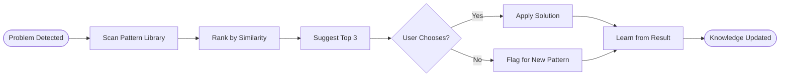

# Pattern Matching Process

## Process Metadata
- **Version**: 1.0
- **Status**: active
- **Scope**: global (all problem-solving scenarios)
- **Owner**: architect
- **Last Updated**: 2025-01-26
- **Validated Through**: To be validated (starting at 50% confidence)

## Purpose
Automatically suggests solutions based on similar past problems and patterns. Accelerates problem-solving by leveraging accumulated knowledge.

## Process Diagram


## Trigger Conditions
- [ ] Spinning wheels detected (no progress)
- [ ] Help request initiated
- [ ] Error pattern recognized
- [ ] Similar context identified
- [ ] Manual pattern search requested

## Process Steps

### Step 1: Scan Pattern Library
- **Actor**: system (automatic)
- **Time**: < 2 seconds
- **Action**: Search all documented patterns
- **Search Criteria**:
  - Error message similarity
  - Context matching (file type, operation)
  - Technology stack overlap
  - Historical success rate
- **Output**: Pattern candidates

### Step 2: Rank by Similarity
- **Actor**: system
- **Time**: < 1 second
- **Action**: Score and sort patterns
- **Scoring Formula**:
  ```
  Score = (Context Match × 0.4) + 
          (Error Match × 0.3) + 
          (Success Rate × 0.2) + 
          (Recency × 0.1)
  ```
- **Output**: Ranked pattern list

### Step 3: Suggest Solutions
- **Actor**: system
- **Time**: Immediate display
- **Action**: Present top 3 matches
- **Format**:
  ```markdown
  ## 🛟 PATTERN MATCHER ACTIVATED
  **Problem**: [Current issue description]
  **Similar Patterns Found**: [count] matches

  ### Suggestion 1 ([match]% match)
  **Pattern**: [Pattern name]
  **Source**: [Where it worked before]
  **Solution**: [What to do]
  **Success Rate**: [%] ([x/y] uses)
  ```
- **Output**: Actionable suggestions

### Step 4: Apply Chosen Solution
- **Actor**: developer
- **Time**: Varies by solution
- **Action**: Implement suggested pattern
- **Tracking**:
  - Which suggestion chosen
  - Implementation time
  - Success/failure
  - Modifications needed
- **Output**: Solution result

### Step 5: Learn from Result
- **Actor**: system
- **Time**: < 1 minute
- **Action**: Update pattern effectiveness
- **Updates**:
  - Success rate adjustment
  - Context refinement
  - Solution improvements
  - New edge cases
- **Output**: Improved patterns

### Step 6: Create New Pattern (if needed)
- **Actor**: developer + technical_writer
- **Time**: 10-15 minutes
- **Action**: Document new solution
- **When**: No good matches found
- **Template**: Use PATTERN_TEMPLATE
- **Output**: New pattern entry

## Pattern Matching Examples

### Example 1: SQL Generation Issue
```markdown
**Problem**: SQL generation failing for CreateDatabase
**Match 1** (89%): Complex WITH clause handling
  - Use StringBuilder with clause builders
  - Success rate: 94%
**Match 2** (76%): Database name escaping  
  - Use database.escapeObjectName()
  - Success rate: 100%
```

### Example 2: Test Failures
```markdown
**Problem**: Integration tests keep failing
**Match 1** (92%): JAR file caching
  - Manually refresh test harness JARs
  - Success rate: 87%
**Match 2** (71%): Environment mismatch
  - Verify database connection string
  - Success rate: 65%
```

## Pattern Library Structure
```
patterns/
├── errors/
│   ├── sql-generation/
│   ├── test-failures/
│   └── build-issues/
├── solutions/
│   ├── change-implementation/
│   ├── testing-strategies/
│   └── debugging-approaches/
└── anti-patterns/
    ├── what-not-to-do/
    └── common-mistakes/
```

## Integration Points

### With Rules
- Triggered by THREE_STRIKE_META_RULE (after 3 failed attempts)
- Limited by THREE_STRIKE_META_RULE (try only top 3 patterns)
- Supports ITERATION_WITHOUT_PROGRESS_RULE
- Feeds confidence scoring

### With Other Processes
- Receives patterns from SUCCESS_AMPLIFIER
- Provides input to FAILURE_ANALYSIS
- Updates DEVELOPMENT_CYCLE templates

## Metrics
- **Initial Confidence**: 50% (needs validation)
- **Success Metric**: Solution match rate >70%
- **Value Metric**: Time saved vs manual search

## Related Documents
- Processes: SUCCESS_AMPLIFIER_PROCESS (pattern source)
- Patterns: Pattern library (knowledge base)
- Templates: PATTERN_TEMPLATE.md

## Learning History
| Date | Learning | Impact |
|------|----------|--------|
| 2025-01-26 | Process created from LBCF | To be validated |

## Change Log
| Version | Date | Change | Reason |
|---------|------|--------|--------|
| 1.0 | 2025-01-26 | Initial version | Smart help system |