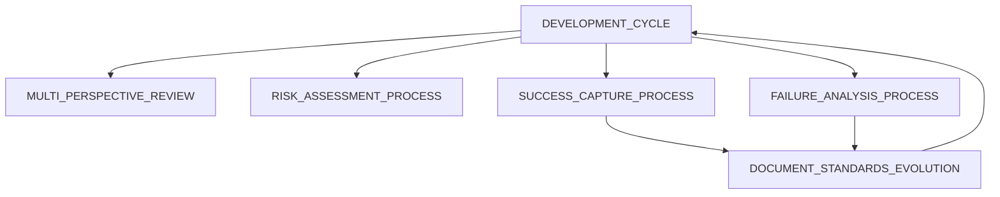

# System Processes Overview

This document provides a quick reference to all processes in our development system.

## Core Development Processes

1. **[DEVELOPMENT_CYCLE](DEVELOPMENT_CYCLE.md)** (v2.0, active, validated)
   - The 5-phase development loop
   - Requirements → Implementation → Test → Document → Retrospective

2. **[DOCUMENT_STANDARDS_EVOLUTION](DOCUMENT_STANDARDS_EVOLUTION.md)** (v2.0, active, validated)
   - How standards evolve through retrospectives
   - Ensures living documentation

## Quality Processes

3. **[MULTI_PERSPECTIVE_REVIEW](MULTI_PERSPECTIVE_REVIEW.md)** (v1.0, active, 50% confidence)
   - Review work from multiple role perspectives
   - Catches issues single view would miss

4. **[RISK_ASSESSMENT_PROCESS](RISK_ASSESSMENT_PROCESS.md)** (v1.0, active, 50% confidence)
   - Break complex tasks into components
   - Assess confidence per component
   - Focus help on high-risk areas

## Learning Processes

5. **[SUCCESS_CAPTURE_PROCESS](SUCCESS_CAPTURE_PROCESS.md)** (v1.0, active, 50% confidence)
   - Immediately document wins
   - Extract reusable patterns
   - Boost team confidence

6. **[FAILURE_ANALYSIS_PROCESS](FAILURE_ANALYSIS_PROCESS.md)** (v1.0, active, 50% confidence)
   - Systematic learning from failures
   - Root cause analysis
   - Process improvement

## Process Templates

- **[PROCESS_TEMPLATE](PROCESS_TEMPLATE.md)** - Standard format for all processes
- **[RULE_TEMPLATE](../rules/RULE_TEMPLATE.md)** - Standard format for all rules

## Process Confidence Levels

| Process | Confidence | Status |
|---------|------------|---------|
| DEVELOPMENT_CYCLE | 95% | Validated through use |
| DOCUMENT_STANDARDS_EVOLUTION | 90% | Proven effective |
| MULTI_PERSPECTIVE_REVIEW | 50% | New, needs validation |
| RISK_ASSESSMENT_PROCESS | 50% | New, needs validation |
| SUCCESS_CAPTURE_PROCESS | 50% | New, needs validation |
| FAILURE_ANALYSIS_PROCESS | 50% | New, needs validation |

## Process Interactions

## When to Use Which Process

| Situation | Use Process |
|-----------|-------------|
| Starting any new feature | DEVELOPMENT_CYCLE |
| Complex task with unknowns | RISK_ASSESSMENT_PROCESS |
| Completed implementation | MULTI_PERSPECTIVE_REVIEW |
| Something worked well | SUCCESS_CAPTURE_PROCESS |
| Something failed | FAILURE_ANALYSIS_PROCESS |
| During retrospectives | DOCUMENT_STANDARDS_EVOLUTION |

## Process Evolution

Like rules, processes start at 50% confidence when newly created from experience or wisdom. Through use, they're validated, adjusted, and their confidence grows. See the retrospective phase of DEVELOPMENT_CYCLE for how we review and improve processes.