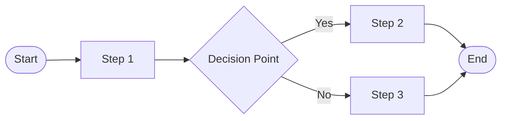

# Process Name

## Process Metadata
- **Version**: 1.0
- **Status**: [draft|validated|active]
- **Scope**: [global|project-specific|role-specific]
- **Owner**: [role responsible for maintaining this process]
- **Last Updated**: YYYY-MM-DD
- **Validated Through**: [evidence of successful use]

## Purpose
[Clear statement of what this process achieves and why it exists]

## Process Diagram

## Prerequisites
- [ ] Required state/conditions before starting
- [ ] Required resources/tools
- [ ] Required permissions/access

## Process Steps

### Step 1: [Name]
- **Actor**: [role/system performing this step]
- **Action**: [specific action to take]
- **Input**: [what's needed to start]
- **Output**: [what's produced]
- **Success Criteria**: [how to know it's complete]
- **Common Issues**: [known problems and solutions]

### Step 2: [Name]
[Repeat structure for each step]

## Decision Points

### Decision: [Name]
- **Criteria**: [what determines the path]
- **Option A**: [condition] → [next step]
- **Option B**: [condition] → [next step]

## Exit Criteria
- [ ] All outputs produced
- [ ] Quality gates passed
- [ ] Next process can begin

## Rollback Procedure
[What to do if process fails or needs to be undone]

## Metrics
- **Average Duration**: [time]
- **Success Rate**: [percentage]
- **Common Failure Points**: [where things go wrong]

## Related Documents
- Rules: [applicable rules]
- Patterns: [reusable patterns]
- Tools: [automation available]

## Change Log
| Version | Date | Change | Reason |
|---------|------|--------|--------|
| 1.0 | YYYY-MM-DD | Initial version | Process established |