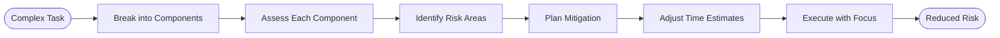

# Risk Assessment Process

## Process Metadata
- **Version**: 1.0
- **Status**: active
- **Scope**: global (all complex tasks)
- **Owner**: developer (before implementation)
- **Last Updated**: 2025-01-26
- **Validated Through**: To be validated (starting at 50% confidence)

## Purpose
Break complex tasks into components and assess confidence per component before starting. Identifies high-risk areas early, allowing targeted help-seeking and better time estimates.

## Process Diagram


## When to Use
- [ ] New type of implementation
- [ ] Confidence <85% on overall task
- [ ] Multiple unknowns identified
- [ ] Time estimate uncertainty >50%
- [ ] Integration with unfamiliar systems
- [ ] Critical path work

## Process Steps

### Step 1: Component Breakdown
- **Actor**: developer
- **Time**: 5-10 minutes
- **Action**: Decompose task into parts
- **Method**:
  1. List all subtasks required
  2. Identify dependencies
  3. Group related items
  4. Order by sequence
- **Output**: Component list

### Step 2: Confidence Assessment
- **Actor**: developer
- **Time**: 5 minutes
- **Action**: Score each component
- **Format**:
  ```markdown
  ## Task: [Overall Task Name]
  Overall Confidence: [Weighted Average]%
  
  | Component | Confidence | Risk Level | Time Est | Notes |
  |-----------|------------|------------|----------|-------|
  | Component 1 | 95% | Low | 15 min | Done many times |
  | Component 2 | 85% | Low | 30 min | Clear pattern |
  | Component 3 | 70% | Medium | 45 min | Some unknowns |
  | Component 4 | 45% | HIGH | ??? | Need help |
  ```
- **Output**: Risk matrix

### Step 3: Risk Identification
- **Actor**: developer
- **Time**: 5 minutes
- **Action**: Focus on <80% components
- **Categories**:
  - **Knowledge Risks**: Don't know how
  - **Technical Risks**: Complex implementation
  - **Integration Risks**: External dependencies
  - **Time Risks**: Uncertain duration
- **Output**: Prioritized risk list

### Step 4: Mitigation Planning
- **Actor**: developer + team
- **Time**: 10 minutes
- **Action**: Plan risk reduction
- **Strategies**:
  ```markdown
  For each HIGH risk component:
  
  Knowledge Risk → Research or ask expert
  Technical Risk → Find examples/patterns
  Integration Risk → Test early/isolation
  Time Risk → Add buffer/timeboxing
  ```
- **Output**: Mitigation plan

### Step 5: Time Adjustment
- **Actor**: developer/PM
- **Time**: 5 minutes
- **Action**: Update estimates
- **Method**:
  - Use TIME_ESTIMATION_RULE
  - Add buffers for risks
  - Include mitigation time
  - Set checkpoints
- **Output**: Realistic timeline

### Step 6: Focused Execution
- **Actor**: developer
- **Time**: Variable
- **Action**: Execute with risk awareness
- **Approach**:
  1. Start with highest risk items
  2. Validate assumptions early
  3. Checkpoint at risk boundaries
  4. Pivot quickly if needed
- **Output**: Risk-aware implementation

## Example Risk Assessments

### Example 1: Complex Feature
```markdown
## Task: Implement CreateWarehouseChange
Overall Confidence: 73% (MEDIUM RISK)

| Component | Confidence | Risk | Time | Notes |
|-----------|------------|------|------|-------|
| Change class structure | 95% | Low | 20 min | Standard pattern |
| Validation logic | 90% | Low | 15 min | Clear rules |
| SQL generation | 65% | HIGH | 60 min | Complex WITH clause |
| Integration tests | 85% | Low | 30 min | Have examples |
| Rollback support | 40% | HIGH | ??? | No clear pattern |

High Risk Mitigation:
1. SQL Generation (65%)
   - Research Snowflake WITH syntax
   - Find similar examples
   - Test incrementally
   
2. Rollback (40%)
   - Ask architect for pattern
   - Document as limitation if needed
   - Timebox to 30 minutes
```

### Example 2: Integration Task
```markdown
## Task: Multi-Database Support
Overall Confidence: 58% (HIGH RISK)

| Component | Confidence | Risk | Time | Notes |
|-----------|------------|------|------|-------|
| MySQL support | 80% | Low | 45 min | Have docs |
| PostgreSQL support | 75% | Med | 60 min | Some experience |
| Oracle support | 45% | HIGH | ??? | Never used |
| SQL Server support | 50% | HIGH | ??? | Limited knowledge |
| Test coordination | 40% | HIGH | ??? | Complex setup |

Risk-Based Approach:
1. Start with Oracle (lowest confidence)
2. Get help on test coordination upfront
3. Timebox each database to 2 hours
4. Document limitations acceptable
```

## Risk Patterns

### Common High-Risk Components
- Rollback implementation (often 40-60%)
- Performance optimization (50-70%)
- Multi-threading (40-60%)
- Complex SQL (60-80%)
- External integrations (50-70%)

### Risk Indicators
- "Never done this before" → <50%
- "Did similar once" → 60-70%
- "Done this few times" → 70-85%
- "Standard pattern" → 85-95%

## When to Abort/Pivot

### Abort Criteria
- Overall confidence <50% after research
- Multiple components <40%
- No mitigation strategies available
- Time risk exceeds project buffer

### Pivot Options
- Reduce scope to high-confidence parts
- Get dedicated help for low-confidence
- Research/spike first
- Find alternative approach

## Metrics
- **Initial Confidence**: 50% (needs validation)
- **Success Metric**: Fewer surprise delays
- **Quality Metric**: Better risk communication

## Related Documents
- Rules: CONFIDENCE_THRESHOLDS, TIME_ESTIMATION_RULE
- Processes: Planning, Multi-perspective review

## Learning History
| Date | Learning | Impact |
|------|----------|--------|
| 2025-01-26 | Process created from LBCF | To be validated |

## Change Log
| Version | Date | Change | Reason |
|---------|------|--------|--------|
| 1.0 | 2025-01-26 | Initial version | Proactive risk management |