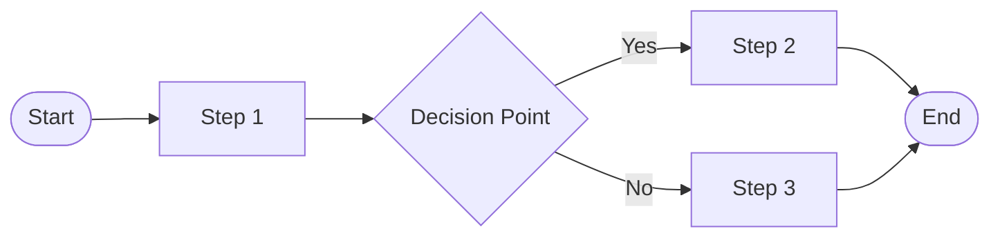

# Process Name

## Process Metadata
- **Version**: 1.0
- **Status**: [draft|validated|active|deprecated]
- **Scope**: [global|project-specific|role-specific]
- **Owner**: [role responsible for maintaining this process]
- **Last Updated**: YYYY-MM-DD
- **Confidence**: 50% (new process, unvalidated)

## Performance Metrics
- **Times Applied**: 0
- **Success Rate**: N/A
- **Last Applied**: Never
- **Average Time Impact**: Unknown

## Purpose
[Clear statement of what this process achieves and why it exists]

## Process Diagram

## Prerequisites
- [ ] [Required condition 1]
- [ ] [Required condition 2]
- [ ] [Required condition 3]

## Process Steps

### Step 1: [Name]
- **Actor**: [who performs this]
- **Time**: [expected duration]
- **Action**: [what they do]
- **Input**: [what's needed]
- **Output**: [what's produced]
- **Success Criteria**: [how to know it worked]
- **Common Issues**: [typical problems and solutions]

### Step 2: [Name]
- **Actor**: [who performs this]
- **Time**: [expected duration]
- **Action**: [what they do]
- **Input**: [what's needed]
- **Output**: [what's produced]
- **Success Criteria**: [how to know it worked]
- **Common Issues**: [typical problems and solutions]

## Decision Points

### Decision: [Name]
- **Criteria**: [what determines the path]
- **Option A**: [condition] → [next step]
- **Option B**: [condition] → [next step]

## Exit Criteria
- [ ] All outputs produced
- [ ] Quality gates passed
- [ ] Next process can begin

## Rollback Procedure
[What to do if process fails or needs to be undone]

## Metrics
- **Current Confidence**: 50% (new process)
- **Average Duration**: [time]
- **Success Rate**: [percentage]
- **Common Failure Points**: [where things go wrong]

## Effectiveness Metrics
- **Time Saved**: [Estimated time saved per use]
- **Quality Improved**: [How quality improves]
- **Errors Prevented**: [Types of errors avoided]
- **Process Efficiency**: [Compared to alternatives]

## Learning Connections
- **Reinforces**: [Other processes/rules this supports]
- **Conflicts With**: [Potential conflicts to watch]
- **Depends On**: [Prerequisite knowledge/processes]
- **Enables**: [What this makes possible]

## Feedback Protocol
- **Success**: +10% confidence (process worked smoothly)
- **Failure**: -15% confidence (process failed)
- **Modification**: -5% confidence (needed changes)
- **Review Triggers**: After 10 uses, monthly, or on failure

## Related Documents
- Rules: [applicable rules]
- Processes: [related processes]
- Patterns: [reusable patterns]
- Tools: [automation available]

## Confidence Evolution
| Date | Event | Old Conf | New Conf | Evidence |
|------|-------|----------|----------|----------|
| YYYY-MM-DD | Created | 0% | 50% | New process |

## Change Log
| Version | Date | Change | Reason |
|---------|------|--------|--------|
| 1.0 | YYYY-MM-DD | Initial version | Process established |