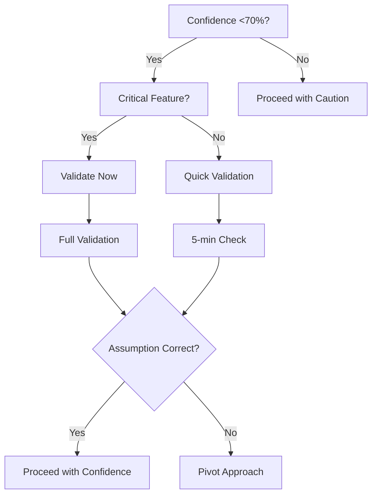

# Assumption Validator Rule

## Rule Metadata
- **Version**: 1.0
- **Type**: global
- **Severity**: high
- **Enforcement**: automatic (confidence-based)
- **Status**: active
- **Confidence**: 50% (new rule, unvalidated)
- **Last Updated**: 2025-01-26

## Performance Metrics
- **Times Applied**: 0
- **Success Rate**: N/A
- **Last Applied**: Never
- **Average Time Impact**: Unknown

## Purpose
Forces validation of assumptions when confidence is low. Prevents wasting time on incorrect assumptions by requiring verification before proceeding.

## Rule Statement
**WHEN** confidence <70% on approach/assumption
**THEN** MUST validate assumption before proceeding
**NOT** "I think this works" → implement → fail → debug
**BUT** "I think this works" → verify → proceed/pivot
**ELSE** waste hours on wrong foundations

## Scope
- **Applies To**: All technical decisions
- **Exceptions**: Explicit experimentation time

## Detailed Specification

### Confidence Triggers
- **<70%**: Mandatory validation
- **70-84%**: Recommended validation
- **85%+**: Proceed with monitoring

### Quick Validation Methods

#### Method 1: Check Existing Patterns (5 min)
```markdown
## Pattern Check
Looking for: [What pattern/approach]
Found in: [Which files]
Confidence boost: [Previous 65% → Now 85%]
Decision: [Proceed/Pivot]
```

#### Method 2: Test Minimal Example (10 min)
```markdown
## Minimal Test
Assumption: [What you think works]
Test code: [5-10 lines]
Result: [Works/Fails]
Learning: [What's actually true]
```

#### Method 3: Read Specific Docs (5 min)
```markdown
## Documentation Check
Question: [Specific question]
Source: [Official docs section]
Answer: [What docs say]
Confidence: [New level]
```

#### Method 4: Trace Existing Code (10 min)
```markdown
## Code Trace
Starting point: [Working example]
Key finding: [How it actually works]
My assumption: [Right/Wrong]
Adjustment: [What to change]
```

### Common Assumptions to Validate

#### Database Behavior
```java
// ASSUMPTION: All databases support IF NOT EXISTS
// VALIDATION: Check database.supports() method
// RESULT: Only some databases support it

// Wrong assumption:
sql.append("IF NOT EXISTS ");

// Validated approach:
if (database.supportsCreateIfNotExists(type)) {
    sql.append("IF NOT EXISTS ");
}
```

#### Framework Patterns
```java
// ASSUMPTION: Can use immutable pattern
// VALIDATION: Check how framework instantiates
// RESULT: Needs mutable JavaBean pattern

// Wrong assumption:
public final class Statement {
    private final String name;
    // Framework can't instantiate
}

// Validated approach:
public class Statement {
    private String name;
    // Setters and getters
}
```

#### API Behavior
```java
// ASSUMPTION: Method returns null if not found
// VALIDATION: Check method documentation
// RESULT: Throws exception instead

// Wrong assumption:
Object result = api.find(id);
if (result == null) { }

// Validated approach:
try {
    Object result = api.find(id);
} catch (NotFoundException e) { }
```

## Validation Decision Tree



## Examples

### Example 1: Prevented 2-Hour Mistake
```markdown
Assumption: "Snowflake CREATE SCHEMA works like PostgreSQL"
Confidence: 60%
Validation: Checked docs (5 min)
Finding: Completely different syntax
Pivot: Used Snowflake-specific approach
Time saved: ~2 hours of debugging
```

### Example 2: Confirmed Approach
```markdown
Assumption: "Service loader finds classes automatically"
Confidence: 65%
Validation: Traced existing example (10 min)
Finding: Need META-INF registration
Adjustment: Added service file
Result: Worked first try
```

### Example 3: Discovered Edge Case
```markdown
Assumption: "Escape method handles all cases"
Confidence: 68%
Validation: Tested edge cases (10 min)
Finding: Doesn't handle unicode
Adjustment: Added special handling
Result: Prevented production bug
```

## Cost of Unvalidated Assumptions

### Time Cost
- Wrong assumption: 1-4 hours debugging
- Validation time: 5-15 minutes
- ROI: 10-50x time saved

### Quality Cost
- Bugs from assumptions
- Rework required
- Trust erosion
- Technical debt

### Example Timeline
```
10:00 - Start with assumption (65% confidence)
10:05 - Should validate... but didn't
10:30 - Implementation "complete"
10:45 - Tests failing mysteriously
11:15 - Still debugging
11:45 - Discover assumption wrong
12:00 - Reimplement correctly
Total: 2 hours wasted vs 15 min validation
```

## Validation Patterns

### The "Show Me" Pattern
Don't assume, verify:
- "The API probably..." → Check API docs
- "It should work like..." → Find example
- "I think it returns..." → Test it

### The "Proof of Concept" Pattern
Before full implementation:
- Write 10-line test
- Verify core assumption
- Then build full solution

### The "Reference Implementation" Pattern
Find working example:
- Locate similar feature
- Trace how it works
- Adapt pattern

## Metrics
- **Initial Confidence**: 50% (needs validation)
- **Success Metric**: <5% wrong assumption rate
- **Value Metric**: Hours saved from validation

## Effectiveness Metrics
- **Time Saved**: Estimated 1-4 hours per prevented wrong assumption
- **Errors Prevented**: Wrong approach errors
- **Rework Reduced**: Estimated 80% when applied

## Learning Connections
- **Reinforces**: ITERATION_WITHOUT_PROGRESS_RULE
- **Conflicts With**: None identified
- **Depends On**: CONFIDENCE_THRESHOLDS
- **Leads To**: Faster correct implementation

## Feedback Protocol
- **Success**: +10% confidence (prevented waste)
- **Failure**: -15% confidence (didn't catch bad assumption)
- **Modification**: Reset to 50%
- **Review Triggers**: After 10 uses or monthly

## Related Documents
- Rules: CONFIDENCE_THRESHOLDS (levels)
- Rules: ITERATION_WITHOUT_PROGRESS (assumptions)
- Processes: Research validation

## Confidence Evolution
| Date | Event | Old Conf | New Conf | Evidence |
|------|-------|----------|----------|----------|
| 2025-01-26 | Created | 0% | 50% | New rule from LBCF |

## Change Log
| Version | Date | Change | Reason |
|---------|------|--------|--------|
| 1.0 | 2025-01-26 | Initial version | Prevent assumption waste |